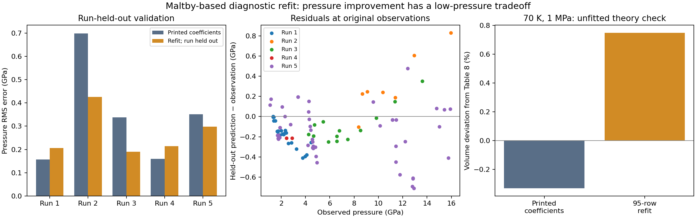

# Maltby 2024: rounding audit and constrained refit

**Outcome: a limited pressure improvement, not a validated replacement EOS.**
The source-informed 95-point diagnostic subset improves from 0.34776 GPa RMS
with the printed coefficients to 0.27437 GPa under leave-one-run-out validation.
However, the refit worsens the unfitted low-pressure volume check and the three
available external Ono points. Every principal fit reaches the lower bound on
its adjustable energy parameter. The candidate remains research-only and is not
added to EOSMAT or recommended as a pressure standard.

Run `PYTHONPATH=. python scripts/audit_maltby_2024_refit.py --plot` to regenerate
[the complete report](../data/argon-maltby-2024-refit.json) and the figure below.
The JSON contains every original sample identifier, exclusion, split, parameter
set, prediction, metric, objective, parameter bound and input-data SHA-256.

## Sources and equation review

The [original source audit](argon-maltby-2024.md) identifies and hashes the
accepted manuscript and official supplement for
[Maltby, Hammer and Wilhelmsen (2024)](https://doi.org/10.1063/5.0237497).
This follow-up rechecked Eqs. (4), (7)--(19), Tables 1, 3, 8 and the supplement's
pressure expressions and entire fcc neighbour table. All coefficients retain
their printed values in `Maltby2024Published`.

The pressure is the full volume derivative of the Helmholtz energy, including
both explicit density dependence of the effective potential and the moving
cutoff. Re-evaluating potential alternatives at 70 K, 23.97 cm3/mol gives:

| Interpretation | Pressure (MPa) |
|---|---:|
| Full derivative, geometric fcc, cutoff squared 64 | -4.225980 |
| Omit the explicit density derivative | -19.098668 |
| Hold the instantaneous cutoff fixed when differentiating the tail | -3.797305 |
| Use the literal printed SI.1 neighbour list | -5.495376 |
| Table 8 target | 1.000000 |

The latter three are diagnostics, not alternative implementations adopted by
Peritheos. SI Eqs. (1)--(4) do not explicitly describe how their virial notation
includes the density-dependent potential in main Eq. (16); they are insufficient
to establish a different thermodynamically consistent convention. The source's
Debye integral is still one third of the common normalized Debye function;
zero-point energy remains a separate term. No additive energy/entropy reference
shift can change pressure.

### A concrete inconsistency in the official neighbour table

A complete comparison finds **one discrepancy** in Table SI.1: at squared
nearest-neighbour distance 14 it lists 48 neighbours; the actual fcc count is
zero. In half-cell coordinates this would require three integer squares to sum
to 28, which is impossible. A separate enumeration using four fcc basis sites
in conventional cubic cells confirms the generated counts. Every other printed
entry through squared distance 64 agrees.

Including the spurious entry gives 23.87128108 cm3/mol at 70 K, 1 MPa, further
from 23.97 than the geometric value 23.89042753. It therefore does not repair
the reproduction. This corrects the earlier audit's claim of an unqualified
match to SI.1, which was based on spot checks. The geometric implementation
and its published numerical outputs remain unchanged.

All 235 geometrically occupied cutoffs through squared distance 256 were also
checked. None reproduces Table 8 at its stated volume. The closest pressure is
-4.15742 MPa at squared cutoff 24; increasing the cutoff converges near -4.22 MPa.
The author's actual numerical cutoff remains unknown.

## Could printed coefficient precision explain it?

Each of the 31 implemented coefficients was varied separately by half a unit
of its last printed decimal place. These are **rounding intervals, not parameter
uncertainties**. Joint bounded pressure minimization/maximization used two
starting points for each extremum. These are numerical searches, not formal
interval bounds or a proof excluding every unpublished convention.

At the stated volume and cutoff squared 64:

| Assumed rounding | Numerically found pressure range (MPa) | Volume range at 1 MPa (cm3/mol) |
|---|---:|---:|
| Half the last printed place for every coefficient | -6.12664 to -2.31635 | 23.86161 to 23.91945 |
| Additionally allow 140 and 550 to mean nearest ten (±5) | -8.66609 to 0.25488 | 23.82351 to 23.95860 |

Even the permissive case misses Table 8's rounded volume interval
[23.965, 23.975] cm3/mol. At its pressure-maximizing coefficients and the lower
volume endpoint, pressure is 0.58121 MPa rather than 1 MPa. Within these tested
assumptions, rounding alone does not account for the discrepancy.

Changing only rmin from 3.802 to 3.80622109 Å would force the one-point pressure
match. That change is 4.22 printed last-place units, well beyond ±0.5 rounding
units. This is recorded solely as a sensitivity diagnostic; it is neither a
fit to experiments nor an adopted correction.

## Refit design and data selection

The original 288-row Dewaele supplement is preserved. The previously examined
130 rows have finite 0 < P <= 16 GPa and 0 <= T <= 300 K. Original pressures,
lattice parameters, temperatures and repeated rows are retained. Source sample
labels are not unique (`Ar_cell4_027` and `Ar_cell5_027` repeat), so fold
membership uses dataset plus original CSV line as a unique row identifier. No fitted or
adjusted observation coordinates are substituted.

The principal fit excludes P > 5 GPa from pure-Ar runs 1 and 4, following
[Dewaele's rationale](https://doi.org/10.1038/s41598-021-93995-y) for avoiding stressed measurements, while keeping runs
2, 3 and 5 within the limits above. This leaves **95 rows**, with run counts
25, 7, 13, 2 and 48. This is **not Maltby's 38-row primary selection**, and
although the count coincidentally equals a previously documented Dewaele
room-temperature fit count, it is a different subset including cryogenic run 5.
The exact 35 exclusions from the 130-row set are listed in the report.

This selection covers 1.08289--15.95736 GPa and 5.5--300 K, with molar volumes
12.00349--19.81407 cm3/mol. Only run 5 contains low-temperature observations;
coverage is not a rectangular validated domain or a phase-stability claim.
The 70 K, 1 MPa check is well outside the observed pressure/volume coverage.

Two Buckingham coefficients vary:

- epsilon/kB: initially constrained to ±5% around 134.7 K;
- rmin: constrained to ±1% around 3.802 Å.

All 29 remaining implemented coefficients are fixed, including zero-point,
Debye, Einstein, anharmonic, alpha_r and lambda parameters. The outer zero
sigma is recomputed from the current Buckingham parameters. Cutoff squared 64
is held fixed. These bounds limit a diagnostic exploration; they are not
source-reported confidence intervals.

The primary objective is `sum_run mean_rows_in_run((P_model-P_observed)^2)`.
This gives each training run equal aggregate weight. Dewaele supplies no
row-wise coordinate errors or covariance for these observations, so no invented
uncertainties, reduced chi-square or confidence intervals are reported. Equal
weight per row and a wider epsilon bound are sensitivity checks.

Five fits each hold out one complete run. Weights are computed from the
remaining training runs; all repeated measurements from the held-out run remain
out. The two adjustable coefficients and diagnostic alternatives are not chosen
by selecting the best held-out result. Each fit uses bounded least squares from
three deterministic starting points. A final all-training-row fit is reported
separately from held-out predictions.

The published Maltby coefficients themselves used some Dewaele measurements.
Thus this assesses generalization of the **new refit** across runs; it is not a
completely independent validation of the published model. Five runs, including
only one cold run and two selected rows in run 4, give limited evidence.

## Results and sensitivity

All figures below are pressure RMS at original observed coordinates, in GPa.
The first three columns use equal weight per observed row for reporting,
regardless of the objective used in fitting.

| Experiment | Printed coefficients | Training refit | Held-out refit | Held-out equal-run RMS |
|---|---:|---:|---:|---:|
| Principal: 95 rows, equal-run objective | 0.34776 | 0.24792 | 0.27437 | 0.28088 |
| Same rows, equal-row objective | 0.34776 | 0.23862 | 0.25785 | 0.26685 |
| All 130 rows, equal-run objective | 0.48719 | 0.49344 | 0.56061 | 0.51285 |
| Principal rows, epsilon bound widened to ±10% | 0.34776 | 0.23313 | 0.26006 | 0.25024 |

The baseline equal-run RMS is 0.39407 GPa on 95 rows and 0.63250 GPa on all
130. The all-130 result demonstrates why row-averaged and run-averaged errors
must be distinguished: its equal-run error improves, while its row-averaged
error worsens. We do not select whichever statistic looks favourable.

The principal held-out improvement is about **21.1%**, but is uneven:

| Held-out run | Rows | Printed-coefficient RMS | Refit RMS |
|---|---:|---:|---:|
| 1 | 25 | 0.15655 | 0.20594 |
| 2 | 7 | 0.69898 | 0.42553 |
| 3 | 13 | 0.33841 | 0.19045 |
| 4 | 2 | 0.15996 | 0.21434 |
| 5 | 48 | 0.35108 | 0.29792 |

The final principal fit has epsilon/kB=127.965 K and rmin=3.805504285 Å.
**Epsilon hits its lower bound in the final fit and every held-out fold.**
Widening its bound also drives it to the new lower bound, 121.23 K. This is
sensitivity to the fitting constraint, not a well-determined unconstrained
parameter estimate. Full parameter vectors, boundary flags and scaled Jacobian
singular values are retained in the report; no parameter covariance is claimed.

## Unfitted thermodynamic and external checks

The principal refit retains positive isothermal bulk modulus and Cv, with
Cp >= Cv, at all 130 observed states. These are numerical consistency checks,
not evidence of global stability or improved heat-capacity accuracy. The
Helmholtz derivative identity and stable inversion are tested with changed
parameters. Because only temperature-independent terms are adjusted, Cv at a
fixed volume is unchanged.

Table 8 is a set of **calculated source values, not experimental observations**,
and is never included in the fitting objective:

| Quantity | Table 8 | Printed implementation | Principal refit |
|---|---:|---:|---:|
| Volume at 70 K, 1 MPa (cm3/mol) | 23.97 | 23.89043 | 24.14940 |
| Absolute volume deviation (%) | — | 0.332 | 0.748 |
| Cp at 70 K, 23.97 cm3/mol (J/mol/K) | 30.35 | 30.39589 | 30.58433 |
| Expansivity at that T,V (mK^-1) | 1.684 | 1.69744 | 1.74021 |
| Isothermal compressibility at that T,V (GPa^-1) | 0.6412 | 0.646484 | 0.662775 |

At the refit's own 70 K, 1 MPa volume, Cp is 31.22048 J/mol/K, expansivity
1.86582 mK^-1 and isothermal compressibility 0.712517 GPa^-1. Values at fixed
T,V and fixed T,P are kept distinct in the report.

Three [Ono (2020)](https://doi.org/10.1038/s41598-020-58252-8) observations
at 300 K and P <= 16 GPa provide an external pressure comparison. Their RMS
error worsens from **0.71302 to 0.82256 GPa**. No point is removed as an outlier.
The report retains their P,V errors and diagonal propagated residuals, but
pressure calibration differences, stress and unreported correlations prevent
interpreting those residuals as a simple rejection statistic. These points
were not used to tune coefficients, bounds or choose an objective.

Recoverable primary caloric, expansivity and compressibility tables sufficient
for a complete multiproperty refit were not obtained. Table 8 and stability
checks do not replace those measurements. Coexistence calculations and the
fluid reference alignment are not part of this diagnostic.

## Deliverable and next useful action

`Maltby2024Parameters` is an immutable coefficient container and
`Maltby2024Trial(cutoff, parameters)` makes explicit research trials possible
without changing `Maltby2024Published`. Both live in the experimental Python
module. The literal published Rust implementation remains unchanged; no new
native fitted model, EOSMAT selection or Studio pressure curve is added.

The useful next input is the authors' full-precision coefficients, numerical
cutoff, executable sample calculation and exact primary-data selection/weights.
The DOI and title searches, official supplement, NVA manuscript, GitHub
repository search and accessible ThermoPack main source did not supply an
author implementation or correction. This is a record of checked routes, not
proof that no code exists. The manuscript's data-availability statement points
to the article and supplement.

A precise [author request](../author-requests/maltby-2024.md)
is prepared; **no message has been sent**. The corresponding-author address is
listed on the publisher's article page. An answer could distinguish rounding,
a source typo, a convention mismatch and an implementation error before more
parameters are fitted. See also the [dataset request entry](../dataset-requests.md#maltby-et-al-2024-fcc-argon).

## Verification

The audit script completed all rounding searches and multistart fits. The 47
focused tests passed with warnings treated as errors, including original argon
regressions, independently enumerated fcc neighbours, changed-parameter
Helmholtz identities/inversion, immutable source defaults, unique row identity,
dataset hash, whole-run separation and reconstruction of saved held-out
predictions. Ruff lint/format, the modified module's mypy check and a strict
MkDocs build passed. Native code was not modified in this follow-up.
