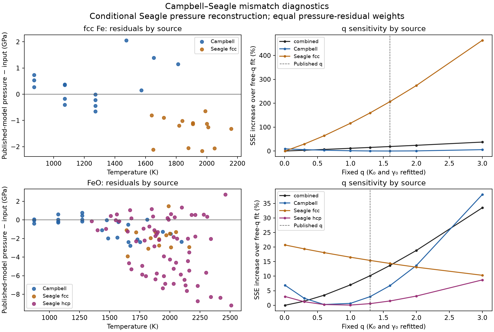

# Diagnosing the Campbell–Seagle coefficient mismatch

This follows the [Campbell source and reconstruction audit](campbell-2009-buffers.md).
It tests which observations drive the combined fits and whether the unresolved
fcc thermal correction explains the disagreement. It does not select new EOS
coefficients or alter the existing pressure reconstruction. **The published
Campbell fcc-Fe and FeO records are retained only as deferred, non-executable
source evidence.** The discrepancy is unresolved; it is not proof that the
publication is wrong.

## Main findings

The largest FeO disagreement comes from **Seagle's hcp-calibrated observations**,
not its 14 fcc observations. The hcp rows contribute **91.16%** of the pressure
residual sum of squares at Campbell's published coefficients. The fcc rows
contribute 5.50%, and Campbell's own rows 3.34%. Adjusting only the fcc
calibration therefore cannot remove most of this disagreement.

For fcc Fe, the Campbell-only fit gives q=1.5805, close to the published 1.6,
but K0=116.554 GPa remains substantially below 133 GPa. Adding Seagle's fcc
observations pushes q to the imposed 0.01 lower bound. These observations
use Fe volume to calculate their pressure, so their comparison to Campbell's
Fe model is partly a comparison between calibration curves, not a new set
of independent pressure measurements.



The left panels show residuals at the **published** Campbell coefficients:
`P_model − P_input`. Negative values mean the model predicts less pressure
than the reconstruction assigns. The right panels fix q at each displayed
value and refit K0 and gamma0. Each curve is normalized by its own free-q
fit's sum of squares; the curves are not confidence intervals. The free-q
fits retain the earlier audit's bounds, including 0.01 ≤ q ≤ 10. The small
FeO/Seagle-fcc subset reaches the upper bound; its profile is therefore
relative to a constrained solution, not an unconstrained optimum.

## Source, temperature and pressure-series contributions

All comparisons here use equal pressure-residual weights and the same fixed
coefficients and bounds as the previous audit. The 29-row fcc and 104-row FeO
selections exclude the two Seagle rows lacking iron volumes. No missing
measurement error is needed or filled for these unweighted diagnostics.

| Material / input group | Rows | Mean published-model residual, GPa | RMS, GPa | Share of total squared residuals |
|---|---:|---:|---:|---:|
| fcc Fe / Campbell | 15 | +0.341 | 0.796 | 24.68% |
| fcc Fe / Seagle fcc | 14 | −1.349 | 1.440 | 75.32% |
| FeO / Campbell | 25 | −0.778 | 1.316 | 3.34% |
| FeO / Seagle fcc | 14 | −1.881 | 2.257 | 5.50% |
| FeO / Seagle hcp | 65 | −2.933 | 4.264 | 91.16% |

For FeO, the 29 reconstructed rows assigned to the nominal 50 GPa series
contribute 43.53% of the total squared residuals, and the 14 rows assigned to
55 GPa contribute 33.18%. Their mean residuals are −3.173 and −5.435 GPa.
Together these groups account for **76.71%**. These nominal assignments are
inherited audit inferences from the FeO expansion lines, not recovered author
run identifiers; the exact row IDs are saved in the diagnostic report.

Temperature partitions use half-open bins: below 1500 K, 1500–<2000 K,
2000–<2500 K and ≥2500 K. In FeO, the 35 rows at 2000–<2500 K contribute
55.17% of the squared residuals. The single 2510 K observation, Seagle row 50,
contributes another 6.51%, with a −9.185 GPa residual. Removing that row still
gives q=0.01. **Removing any one temperature bin or nominal Seagle series
also leaves the FeO fit at that lower bound.** Temperature, pressure and
study coverage are confounded, so this does not isolate a temperature error.

Removing all 65 Seagle hcp rows leaves 39 FeO observations and gives
K0=145.746 GPa, gamma0=1.54831 and q=0.37731. That restores K0 approximately,
but not the thermal coefficients. Conversely, fitting the hcp subset by
itself gives K0=129.037 GPa, gamma0=2.64642 and q=0.86152. The combined q bound
is therefore not simply the hcp subset's own preferred q; it reflects a
compromise among subsets with different coverage and parameter tradeoffs.
Removing a group is diagnostic, not grounds for rejecting its measurements.

The hypothetical Dewaele replacement reduces the hcp group's mean residual
from −2.933 to −0.716 GPa. Nevertheless, those rows still contribute 83.54%
of the total squared residuals on that scale, and the combined coefficients
remain outside the published intervals.

## Remaining thermal-correction assumptions

[Boehler et al. (1990)](https://doi.org/10.1029/JB095iB13p21731), pp. 21734–21735,
uses a mean expansion coefficient relative to 300 K and quotes a volume
exponent of 6.5±0.5 at fixed temperature. Seagle's exact implementation is
unreported. The baseline reconstruction scales that coefficient by the
compressed-to-ambient volume ratio at 300 K. We tested five explicit choices:
the baseline; exponent 6 or 7; evaluating the volume ratio at the 1400 K
reference isotherm; and evaluating it at the observed temperature.

For each choice the volume ratio compares **compressed and ambient volumes
at the same temperature**. All retain the mean-expansion convention:

```text
V0(tr) = 6.835 * [1 + 7.70e-5 * (tr - 300)]
V(tr) = Vobserved * [1 + alpha * (tr - 300)] / [1 + alpha * (Tobserved - 300)]
alpha = 7.70e-5 * [V(tr) / V0(tr)]^delta
V1400 = Vobserved * [1 + alpha * 1100] / [1 + alpha * (Tobserved - 300)]
```

The alpha equation is solved implicitly, then the existing BM3 isotherm and
Basinski reference volume are used. At 1400 K all these conventions reduce
to the same compression curve. We did not replace the mean coefficient with
an exponential instantaneous-expansion law or tune parameters to Campbell.

| Expansion convention | Seagle checkpoint mean / RMS difference, GPa | Mean shift of 14 fitted fcc pressures, GPa | fcc Fe fitted K0 / gamma0 / q | FeO fitted K0 / gamma0 / q |
|---|---:|---:|---|---|
| 300 K ratio, delta=6.5 (baseline) | +2.767 / 2.843 | 0 | 123.958 / 2.02403 / 0.01* | 134.304 / 1.90635 / 0.01* |
| 300 K ratio, delta=6 | +3.319 / 3.412 | +0.149 | 124.239 / 2.03897 / 0.01* | 134.045 / 1.91872 / 0.01* |
| 300 K ratio, delta=7 | +2.264 / 2.326 | −0.139 | 123.697 / 2.01006 / 0.01* | 134.547 / 1.89482 / 0.01* |
| 1400 K ratio, delta=6.5 | +0.705 / 0.782 | −0.803 | 123.085 / 1.93471 / 0.01* | 135.717 / 1.83934 / 0.01* |
| Observed-temperature ratio, delta=6.5 | −0.883 / 1.047 | −1.214 | 124.619 / 1.87858 / 0.16162 | 136.469 / 1.80384 / 0.01* |

K0 is in GPa; * marks the imposed q lower bound. The FeO column retains the
Seagle hcp scale. The report also includes the Dewaele hcp control for every
thermal variant; none restores all three published parameters there either.

All five variants satisfy all eight melting-checkpoint error intervals.
Their different biases demonstrate that those broad intervals cannot choose
a unique thermal implementation. The 1400 K convention substantially improves
checkpoint agreement, but does not restore the fitted coefficients. The
melting checkpoints and the 14 subsolidus regression rows span different
conditions: **the checkpoint bias is not an offset to subtract from every
fit pressure**. No variant has been adopted as the historical calibration.

## What q itself tells us

Holding q at its published value, while refitting K0 and gamma0, raises the
combined pressure-residual sum of squares by **18.81% for fcc Fe** and
**10.16% for FeO**. For Campbell-only observations, the corresponding changes
are just 0.0012% and 2.97%. For the Seagle hcp-only FeO subset, fixing q=1.3
costs only 0.56%, with a compensating change in the other coefficients.
These profiles show substantial parameter tradeoffs and dataset tension;
they do not supply confidence intervals or prove a global optimum.

The evidence now points first to **how Campbell combined or recalibrated the
Seagle observations**, especially the hcp-calibrated rows. Obtaining the actual
combined fit-input table and reduction procedure remains more decisive than
adding more fitting weights. The fcc thermal convention is a real uncertainty,
but resolving it alone is insufficient. Published values are retained
unchanged for inspection; the Fe/FeO records are excluded from executable
discovery and default loading.

## Reproduction

Run `uv run python scripts/diagnose_campbell_2009_mismatch.py --check` to verify
[the complete machine-readable report](../data/campbell-2009-mismatch-diagnostics.json).
Running without `--check` also regenerates the figure. The report retains every
observation, group membership, group-removal fit, fixed-q fit and thermal
variant. Regression tests check the baseline thermal formula against the
previous implementation, preservation of the reference isotherm, recovery of
synthetic coefficients, and exact accounting of residuals across partitions.
