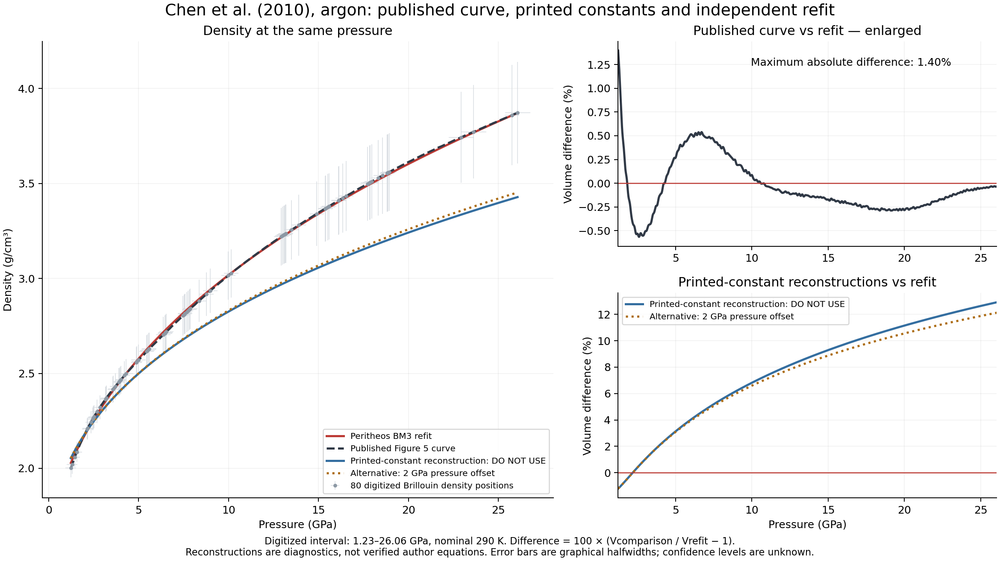
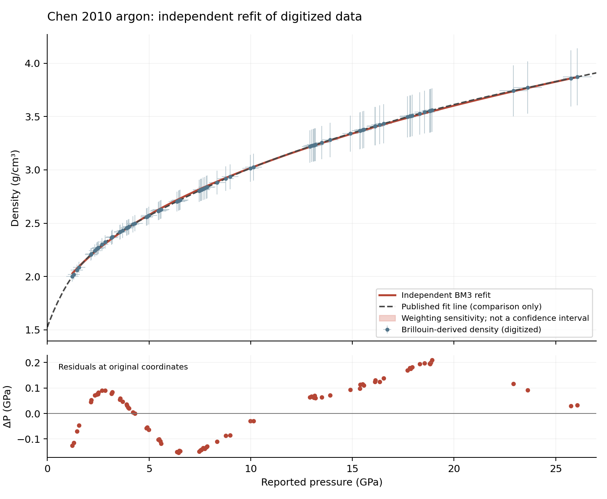

# Chen et al. (2010): original-constant reconstruction and independent refit

**Outcome: original EOS not reproduced; separate Peritheos refit available.**
The paper, density observations and drawn fit line are preserved. At the user's
request, a diagnostic reconstruction of the original printed constants is also
retained for explicit inspection, with a **DO NOT USE** warning. It is not a
verified source-author equation. Substituting its 2 GPa constants for zero-pressure BM3
parameters would be incorrect. The standard BM3 reconstructed from those
local constants also fails the source curve. This is an unresolved source
parameterization problem, not a claim that the experiment is invalid.

## Which record to use

| Record | Meaning | Use |
|---|---|---|
| `argon_fcc_chen_2010_bm3_reported_constants` | Standard BM3 reconstructed from the rounded constants at 2 GPa; `diagnostic`, `not_reproduced` | **DO NOT USE for scientific predictions or pressure calibration.** Explicit inspection/comparison only; never the default. |
| `argon_fcc_chen_2010_bm3_digitized_refit` | Independent Peritheos BM3 fit to 80 digitized density positions; `refit` | Provisional approximation over 1.23–26.06 GPa at nominal 290 K; not an independently validated elastic EOS. |

The diagnostic's stored V0, K0 and K0prime are **derived zero-pressure
coefficients**, not values printed by Chen. The original constraints remain
explicitly recorded at 2 GPa. The paper's drawn Figure 5 curve is preserved as
a third, separate object, not silently replaced by either record.

At 20 GPa, the printed-constant reconstruction predicts **11.15% more volume**
than the refit, while the published drawn curve differs by **−0.28%**. Across
the digitized interval the drawn curve differs from the refit by at most
**1.40%**. Volume differences compare the same pressure and use
100 × (Vcomparison / Vrefit − 1). The refit has **0.111 GPa** RMS pressure
residual on the original marker coordinates, versus **6.880 GPa** for the
printed-constant reconstruction.

The density integration starts at **1.3 GPa**, while the reported elastic
constants refer to **2 GPa**. Both a standard BM3 satisfying the local
constraints and an alternative pressure-offset convention were tested. Neither
resolves the mismatch. The local slope of the plotted curve implies KT about
11 GPa at 2 GPa; the refit gives 12.62 GPa and the paper prints 15.1 GPa.
Close density curves therefore do not establish agreement of elastic properties.

**The cause remains unresolved.** A pressure-calibration error, incorrect
adiabatic correction, reporting/plotting error, or undocumented convention has
not been established. The numerical comparison must not be presented as proof
that the authors used a wrong pressure correction.

The refit's zero-pressure density is **1.6895 g/cm³**, 8.0% above the
**1.564 g/cm³** comparison estimate quoted by Chen and 11.2% above Chen's
**1.52 ± 0.05 g/cm³** extrapolation. Chen describes 1.564 as a room-temperature
estimate based on low-temperature measurements in reference 22 (Smith and
Pings, Physica 29, 555, 1963). We have not independently recovered that thermal
extrapolation. Heating normally lowers solid density at fixed pressure; it
does not by itself reconcile a higher room-temperature density. Ambient-pressure
solid argon at 290 K is an extrapolated branch, not an equilibrium solid state.
The unconstrained fit does not establish reliable zero-pressure density,
modulus or derivative, and no statistical parameter uncertainties are claimed.

The [paper ledger](../paper-investigation-ledger.md#chen-2010-original-constant-reconstruction-and-independent-refit)
and [record ledger](../primary-eos-refits.md#chen-2010-original-constant-reconstruction-and-independent-refit)
show the same comparison. Regenerate it with
`python -m scripts.compare_chen_2010_argon --plot`; the full numerical comparison
is [available as JSON](../data/chen-2010-argon-comparison.json).

## Source and physical interpretation

Bin Chen, A. E. Gleason, J. Y. Yan, K. J. Koski, Simon Clark and Raymond
Jeanloz, *Elasticity, strength, and refractive index of argon at high
pressures*, Physical Review B **81**, 144110 (2010),
[DOI 10.1103/PhysRevB.81.144110](https://doi.org/10.1103/PhysRevB.81.144110).
Published 14 April 2010. The verified five-page publisher PDF was retrieved
from [APS's full-text service](https://harvest.aps.org/v2/journals/articles/10.1103/PhysRevB.81.144110/fulltext).
SHA256: `17a0bcd30604bd81f125894a18a45a91255b235fb80643cddd4bcbc6e5bd01f1`.
The PDF is external to git at
`/Users/clemens/Documents/Peritheos/papers/chen-2010/chen-2010.pdf`.
Title, all authors, DOI, volume/article, and all five page numbers were checked.

The authors measured polycrystalline **fcc** Ar using two Brillouin scattering
angles. XRD confirmed fcc at 4 GPa. The headline range is **1.3–30 GPa** at
room temperature. Table I specifically states **2 GPa and 290 K**, whereas
the strength discussion on page 4 says 300 K. The datasets retain 290 K as
the table reference without pretending the experiment was exactly isothermal
to a known temperature precision. No thermal model is supplied.

Pressure comes from ruby fluorescence, Experimental section reference **14**:
Mao, Bell, Shaner and Steinberg (1978), J. Appl. Phys. 49, 3276. Reference 13
is Mao et al. (1986), but is not the calibration cited for these measurements.
Raw ruby wavelengths are absent, so pressure-scale recalculation is unavailable.
The Figure 4 caption gives typical pressure uncertainty 0.2–0.7 GPa and
velocity uncertainty about 2%; no confidence convention or covariance is stated.

Density is in g/cm³. Converted volumes are conventional **four-atom fcc cells**:

\[
V_{\rm cell}[\mathrm{\AA^3}]
=\frac{4(39.948)}{0.602214076\,\rho[\mathrm{g/cm^3}]}.
\]

The mass conversion uses 39.948 g/mol and the exact Avogadro constant. It does
not add experimental precision. Density remains the source quantity.

## What is actually published

The source prints the acoustic relationships
\(K_S=\rho(V_P^2-4V_S^2/3)\), \(G=\rho V_S^2\), and
\(K_S=(C_P/C_V)K_T\). Its Eq. (4) is

\[
\frac{d\rho}{dP}=\frac{C_P/C_V}{V_P^2-4V_S^2/3},\qquad
\frac{C_P}{C_V}=1+0.25(\pm0.11)\exp[-0.197(\pm0.041)P].
\]

Here P is GPa and velocities are km/s. Integration starts at
**ρ = 2.02 g/cm³, P = 1.3 GPa**. The authors mention numerical integration
and iterations, but supply no full velocity table, interpolation specification,
integration covariance or fit weights. The script implements the printed
pointwise equation without constructing an invented velocity interpolant.

The paper names a third-order Eulerian finite-strain/Birch–Murnaghan EOS,
citing Birch (1977, 1978), but does **not** print its pressure equation or
unrounded coefficient set. It reports:

| Quantity | Value | Location |
|---|---:|---|
| ρ at 2 GPa | 2.18 ± 0.06 g/cm³ | Page 3 text |
| KT at 2 GPa | 15.1 ± 1.1 GPa | Table I |
| dKT/dP at 2 GPa | 5.4 ± 0.3 | Table I |
| KT d²KT/dP² at 2 GPa | −7.3 ± 1.2 | Page 4 text |
| Extrapolated ρ at zero pressure | 1.52 ± 0.05 g/cm³ | Page 3 text/Figure 5 |

All 14 own-study values recovered from Table I and adjacent prose/captions are
in `argon-fcc-chen-2010-reported-values.csv`, including the adiabatic and shear
constants. Comparison rows attributed to other studies are not Chen observations.
The uncertainty symbols are retained; they are not assumed to be one sigma.

## Recovered Figure 5 data

The black squares are **densities derived by integrating Brillouin velocities**.
They are not XRD measurements. The gray crosses are Ross et al. (1986) XRD
comparison data; gray triangles are Shimizu et al. (2001). Neither gray series
is included in the Chen dataset.

`scripts/digitize_chen_2010_argon.py` extracts the vector geometry in the
checksummed PDF, page index 2, using PyMuPDF. Main-axis calibration in PDF
points (origin at page top left):

- P = 0 and 25 GPa: x = 374.885986328125 and 513.6329956054688.
- ρ = 1.5 and 4.0 g/cm³: y = 230.6690673828125 and 81.11602783203125.
- Paths 297–444: black filled squares, side approximately 4.646 points.
- Paths 291–296: matching error-bar segments.
- Path 445: the continuous published fitted line, 261 segments/262 vertices.

The square centers yield **80 distinct PDF positions**, spanning approximately
1.232–26.062 GPa. Repeated graphics commands within 0.005 PDF points are
deduplicated, with rendering multiplicity retained in a separate column.
Closely spaced distinct centers are preserved. Their count is **not** an
original sample count or a claim of statistically independent observations.
The lower plot-derived endpoint differs from the rounded headline 1.3 GPa;
neither was silently altered.

All 80 centers have matched horizontal and vertical graphical error bars.
Halfwidths are retained as plot uncertainties, with confidence convention
unspecified. Conservative additional coordinate-reading bounds are 0.05 GPa
and 0.01 g/cm³; these are not fitted statistical errors. The source errors,
integration correlations, shared anchor and common calibration must be
considered before using an independent-error regression.

The **262 curve vertices are a separate `published_fit_curve` dataset**. They
must render as a line labeled as a published fit, never as measured points or
as a first-principles theory dataset. PDF coordinates are included for both
assets so the extraction is auditable. Figure-derived values are not the
original source tables. Source article/figure rights remain APS's; CC0 applies
only to contributor-held factual transcription and arrangement rights.

## Why an executable published EOS is withheld

We tested an actual nonzero-pressure local reference, not a shifted shortcut.
Every standard BM3 pressure expression can be written, with
\(x=\rho/\rho_2\), as

\[
P(x)=c_3x^3+c_{7/3}x^{7/3}+c_{5/3}x^{5/3}.
\]

Let \(D=x\,d/dx\). Then \(K=DP\) and \(KK'=D^2P\).
Solving these three constraints at x = 1 for the printed P = 2, K = 15.1,
K′ = 5.4 gives **c = (32.5325, −47.415, 16.8825) GPa**. This is a
mathematical reconstruction of rounded local constraints, not a published
coefficient list. The existing native BM3 evaluator reproduces the polynomial
within 8×10⁻¹⁴ GPa over the audit grid.

The stable zero-pressure branch gives ρ₀ = **1.674647 g/cm³**, K₀ =
**2.579673 GPa**, K₀′ = **9.081605**, and cell V₀ = **158.445809 ų**.
Its difference from the printed ρ₀ is 3.09 times the printed 0.05 uncertainty;
this ratio is **not a significance test**, because parameter correlations and
confidence conventions are unknown. It predicts ρ(1.3 GPa) = 2.066389 rather
than the integration anchor 2.02, and KK″(2 GPa) = −5.703635 rather than −7.3.
More decisively, against the 80 drawn densities it gives pressure RMS error
**6.880 GPa**, reaching **19.068 GPa**.

The published line itself gives ρ(2 GPa) ≈ **2.18017 g/cm³**, agreeing with
the text. A local cubic interpolation over 1–3 GPa gives K(2 GPa) ≈
**11.157 GPa**, which differs substantially from the table's 15.1 GPa.
This derivative is only a diagnostic of the drawn line, not an independently
measured modulus.

We also explicitly tested the alternative convention
P = 2 GPa + BM3(V; Vref = Mcell/2.18, Kref = 15.1, K′ref = 5.4).
This pressure-increment formulation gives KK″ = **−7.248889** at 2 GPa,
consistent with the rounded printed −7.3. Thus the second-derivative result
suggests that this alternative reference convention may have been used.
However, it still predicts ρ₀ = **1.633737 g/cm³** and misses the plotted
densities by **6.251 GPa RMS**, with maximum pressure error **16.972 GPa**.
The paper does not print the pressure expression needed to resolve its
convention. Neither interpretation recovers the source density curve; the
alternative is recorded as a diagnostic, not silently adopted as a solution.

We therefore do not describe the diagnostic coefficients as a verified Chen EOS
or silently choose a different equation. They are retained only in the explicitly
marked **DO NOT USE** diagnostic record. The study status is **not_reproduced**.
No full original-data refit or validated parameter covariance is claimed.

## Reproduction and missing inputs

Run `python -m scripts.reproduce_chen_2010_argon` to regenerate
`docs/data/chen-2010-argon-reproduction.json` from the bundled assets.
Run `python scripts/digitize_chen_2010_argon.py /absolute/path/to/chen-2010.pdf`
to reproduce source extraction (optional PyMuPDF dependency).
Tests are in `tests/test_chen_2010_argon.py`.

Checked: complete publisher paper and reference list, APS article metadata,
author-uploaded complete text on ResearchGate, and the local Zotero library.
No supplement is cited in the paper or linked in the accessed APS metadata;
no original numerical observation table was found. A source equation with
its exact reference convention and unrounded coefficients, or original
velocity/density data and fitting procedure, would resolve the ambiguity.
No authors were contacted and no purchase was made.

Packaged supporting-study metadata: `peritheos/data/studies/argon-fcc-chen-2010.json`.
The source constants and published curve have empty `used_by_eos_records`.
The black-square density dataset is linked only to the separate Peritheos
refit below, never to unrelated Dewaele or Ono fits.

## Independent Peritheos refit of the digitized density points

At the user's request, a separate opt-in record is now included:
`argon_fcc_chen_2010_bm3_digitized_refit`, labeled **Chen (2010) — Peritheos BM3
refit of digitized Brillouin densities**. Its `record_kind` is `refit`. This
does not validate or replace the source-author coefficients; the publication's
reproduction status remains `not_reproduced`.

All 80 distinct black-square positions enter once. The 262 published curve
vertices, PDF rendering multiplicities, zero-pressure density and reported
elastic constants are excluded from the regression. No point is fixed as an
anchor. This is a Chen-only fit, not a combined argon EOS. Older Ross
X-ray measurements and low-temperature observations from other studies are
not additional fit inputs. Chen explicitly used the X-ray results as an
independent comparison rather than a constraint on the Brillouin density
reduction; combining temperatures would require an explicit thermal model. The fitted parameters are rho0, K0 and K0prime; rho0 is converted to
four-atom cell V0 after fitting. An independent Python BM3 expression is used
for fitting and checked against the native Peritheos evaluator.

The primary objective is an errors-in-variables least-squares fit:

\[
\sum_i\left[\left(\frac{P_{BM3}(\widetilde\rho_i)-P_i}{s_{P,i}}\right)^2
+\left(\frac{\widetilde\rho_i-\rho_i}{s_{\rho,i}}\right)^2\right].
\]

The 80 adjusted densities are latent fitting coordinates; the stored source
coordinates remain unchanged. The graphical errorbar halfwidths sP and srho
are used as relative coordinate scales, **not asserted to be independent
one-sigma errors**. No reduced chi-square, statistical parameter uncertainties
or covariance is exported. The report preserves the adjusted densities and
reports residuals at both adjusted and original coordinates.

| Parameter or diagnostic | Result |
|---|---:|
| V0, four-atom fcc cell | 157.0544 ų |
| K0 | 4.39886 GPa |
| K0prime | 4.62176 |
| Extrapolated rho0 | 1.68948 g/cm³ |
| Pressure RMS, original coordinates | 0.11120 GPa |
| Maximum pressure residual, original coordinates | 0.20991 GPa |
| Pressure RMS, adjusted coordinates | 0.01860 GPa |
| At 2 GPa: rho, KT, KTprime | 2.17475 g/cm³, 12.61763 GPa, 3.84591 |

The smaller adjusted-coordinate residual must not be advertised as the fit's
agreement with the unadjusted observations. Residual structure remains visible
in the comparison below: a good approximation within plotted error bars is
not proof that BM3 is the exact underlying density relation.

Three distinct initial parameter sets converge to the same solution within
8×10⁻⁸ in fitted density-coordinate parameters, with no active parameter bound.
Parameters are free within broad documented bounds, and no reported Chen
constant is imposed. Sensitivity checks give:

- Equal-pressure regression and four error-in-variables variants with each
  occupied 0.5, 1 or 2 GPa bin receiving unit total weight (including a shifted
  1 GPa grid): maximum predicted volume change **0.617%** in the observed range.
- Common coordinate-reading shifts of ±0.05 GPa or ±0.01 g/cm³ applied to all
  points: maximum volume change **0.522%**.
- Refit after omitting each occupied 1 GPa pressure bin: maximum in-range
  volume change **1.673%**, worst withheld-bin pressure RMS **0.271 GPa**.

These are sensitivity envelopes, not confidence intervals. In particular, the
zero-pressure parameters are less stable: deleting pressure bins moves K0
between 4.13 and 6.37 GPa and V0 between 148.40 and 159.15 ų. The executable
refit is therefore qualified for the digitized interval **1.2319–26.0624 GPa**
at nominal **290 K**; no ambient-pressure solid or extrapolation accuracy is
claimed. Unknown integration correlations remain an important limitation.

Reproduce with `python -m scripts.refit_chen_2010_argon --plot` (Matplotlib is
optional unless plotting). The full numerical report is
`docs/data/chen-2010-argon-refit.json`; solver, bounds, starts, selection and
objective are also embedded in the record's `fit_provenance`.
