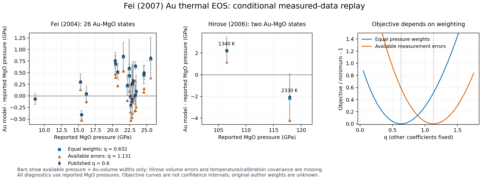

# Fei et al. (2007): Au thermal EOS and conditional fitting replay

The Au EOS is classified as **parity**, qualified as conditional numerical
agreement within the published parameter error widths. A staged unweighted
replay gives **K0-prime = 5.995326** from 37 Dewaele cold rows, followed by
**q = 0.619149** from 28 Fei/Hirose hot rows, with V0/K0/gamma0/theta0 adopted
and fixed. These agree with the printed **6.00(2)** and **0.6(3)**.

The published Au pressure equation is independently reproduced. Original
weights, uncertainty confidence/covariance and exact MgO reduction remain
unresolved. Available-error weighting shifts q substantially. This classification
does not assert source-exact author-fit reproduction or formal combined-two-sigma
agreement. The published coefficients and defaults are retained. The record,
provenance and shared ledgers now carry this qualified parity outcome.

## Primary evidence and recovered measurements

The authority is Fei et al., *Toward an internally consistent pressure scale*,
PNAS **104**, 9182-9186 (2007),
[DOI 10.1073/pnas.0609013104](https://pmc.ncbi.nlm.nih.gov/articles/PMC1890468/).
The original cached full-paper text and page images were inspected, including
Table 1, Equations 2-3 and Figure 1 on page 9183 and the Au refit paragraph
continuing onto page 9184. The cached text has the full original article rather
than a catalog summary. The earlier vector extraction records source-PDF SHA-256
`19109c9685f6862c733ffc14ada22077d61553152b18dab13eb295e8d1da3306`.
That is inherited extraction provenance: attempts to fetch the original PDF anew
returned HTTP 403, so the hash is not independently reverified in this run.

| Measurements | Recovery and fit use | Calibration |
| --- | --- | --- |
| Fei (2004) Table 1, 26 hot rows | Existing numerical Au/MgO lattice parameters, reported pressures and error widths; complete table checked against the original publication | Reported Speziale (2001) MgO pressures |
| Hirose (2006) Table 1, 13 rows | Newly archived original-table transcription with all original columns and exact printed tokens; two hot Run 2 rows enter the thermal fit and one Run 2 cold row enters a cold sensitivity | Retain both Tsuchiya Au and Speziale MgO outputs; use only MgO as independent Au targets |
| Dewaele (2004) Table I, 37 RT rows | Existing numerical transcription with both ruby reductions and 0.01 A^3/atom volume widths | Revised Dewaele ruby pressures |
| Fei (2007) Figure 1, six new RT markers | Existing digitized measured markers; included only in a separate cold-selection sensitivity | Revised Dewaele ruby pressures; no recovered experimental error widths |
| Fei (2007) Figure 1, 111 calculated vertices | Existing vector paths; only equation/output comparisons | Never used as regression observations |

The new data are
[`gold-hirose-2006-table1.csv`](../../peritheos/data/datasets/gold-hirose-2006-table1.csv)
and its
[`source sidecar`](../../peritheos/data/datasets/gold-hirose-2006-source.json).
They are transcribed directly from the
[original publisher Table 1](https://agupubs.onlinelibrary.wiley.com/doi/full/10.1029/2005GL024468).
The publisher lists an original 1012-byte tab-delimited supplement, but its
download returned HTTP 403. The CSV is our verified displayed-table transcription,
not that unrecovered author file. All 13 rows retain source columns, including
heating time, phase observation, both lattice parameters and both pressure
reductions. Derived volumes and first-order volume-error widths are separate
columns. Missing errors remain blank; `3.7106(0)` is preserved as a printed token
without converting the rounded zero width into exact knowledge.

The two usable heated Hirose rows are:

| T (K) | a(Au) (A) | a(MgO) (A) | Reported MgO pressure (GPa) | Printed pressure width (GPa) |
| --- | --- | --- | --- | --- |
| 1340 | 3.7237 | 3.7827 | 106.5 | 1.2 |
| 2330 | 3.7254 | 3.7767 | 117.9 | 2.1 |

Neither row provides Au/MgO lattice-error widths. The other ten heated rows have
Au-derived pressures and lack MgO measurements. They are retained but excluded:
using their Au pressures as targets would make the Au fit circular. The 300 K
paired datum has MgO pressure 102.8 GPa and no supplied pressure-error width.

No additional original numerical Au measurements from Fei (2007) were recovered:
its six new RT observations remain plot-derived. No source-rights claim is made
for any third-party article or table.

## Equation, coefficients and source procedure

The published pressure is a 300 K Vinet isotherm plus a harmonic MGD increment:

\[
P(V,T)=P_{\rm Vinet}(V;V_0,K_0,K'_0)
+\frac{\gamma(V)}{V_m}\{E_D(T,\theta(V))-E_D(300,\theta(V))\},
\]

\[
\gamma(V)=\gamma_0(V/V_0)^q,\qquad
\theta(V)=\theta_0(V/V_0)^{-\gamma(V)}.
\]

Here V is the four-atom fcc conventional cell; V_m = V N_A 10^-30 / 4 in
m^3/mol Au. The Debye energy uses one atom per mole Au, with modern SI R.
There is no additional electronic-pressure term in this published Au model.

| Coefficient | Published value | Printed error width | Role in this replay |
| --- | --- | --- | --- |
| V0 | 67.850 A^3/cell | 0.004 | Fixed source anchor |
| K0 | 167 GPa | None supplied in Fei (2007) Table 1 | Fixed |
| K0-prime | 6.00 | 0.02 | Fixed hot-fit anchor; independently cold-refitted in sensitivities |
| gamma0 | 2.97 | 0.03 | Retained, fixed in the source-supported q replay |
| q | 0.6 | 0.3 | Fitted hot parameter |
| theta0 | 170 K | None supplied | Fixed |

**Fei (2007) gives no confidence level or covariance for these widths.** They are
not converted into 68% or 95% intervals. Dewaele (2004) separately identifies 95%
intervals for its own fit; that convention is not transferred to Fei (2007).
Fei (2004) prints a 0.03 gamma0 width although the upstream Shim (2002) table
prints 0.05; retain the Fei value without silently reconciling that difference.

The source procedure supports a staged reconstruction:

1. Set K0=167 GPa and fit the RT compression on the revised ruby scale to Vinet,
   obtaining K0-prime about 6.0. The paper specifically states that the Dewaele
   dataset produces 6.0 and that the new RT data agree with this curve.
2. Keep the revised RT EOS, gamma0=2.97 and theta0=170 K; refit Au PVT data from
   Fei (2004) and Hirose (2006) for q. The latter is expressly named in the prose
   and Figure 1, despite omission from the Au footnote in Table 1.

The complete 26-row Fei Au-MgO table plus both hot Hirose Au-MgO rows is a
source-supported selection. No author selection file establishes that every row
entered the original regression. Figure 1 plots selected Fei isotherms rather than
all temperatures in its Table 1. Fei (2004)'s earlier q=0.7 was a compromise with
static and shock evidence, not an independently reproduced global optimization.
Fei (2007) does not specify a new shock-data objective or its weights. Shock
points or calculated Hugoniot samples are therefore not silently added here.

## Independent equation and published-curve checks

A 64-point Gauss-Legendre Debye quadrature is compared with an independent
adaptive-quadrature implementation and the executable Au record on 119 PVT
states. Maximum differences are **3.69e-13 GPa** against the record and
**3.41e-13 GPa** against adaptive quadrature. This verifies the published
pressure equation and its unit/reference conventions.

The archived Figure 1 paths have 37 vertices on each isotherm. One printed
pressure-direction stroke is 0.2780 GPa after axis calibration.

| T (K) | Printed-law RMS / maximum difference (GPa) | Integrated-law RMS / maximum difference (GPa) |
| --- | --- | --- |
| 300 | 0.09834 / 0.21860 | 0.09834 / 0.21860 |
| 1473 | 0.03137 / 0.08653 | 0.02566 / 0.07275 |
| 2173 | 0.03104 / 0.08632 | 0.02535 / 0.07137 |

Both conventions lie within that stroke for every vertex. Their largest
inter-convention difference is only **0.02339 GPa**. Thus figure agreement does
not uniquely identify theta(V), unrounded coefficients or fitting weights.
The explicit printed definition remains the source authority for the stored EOS.

For the printed variable-exponent law,

\[
-d\ln\theta/d\ln V=\gamma(V)[1+q\ln(V/V_0)],
\]

which is not gamma(V) when q is nonzero. The integrated sensitivity instead uses
\(\theta=\theta_0\exp[-\gamma_0((V/V_0)^q-1)/q]\), with the continuous q=0 limit.
This mathematical distinction is recorded; neither curve agreement nor pressure
replay validates thermodynamic consistency or licenses changing the published
EOS's convention.

## Cold anchor and thermal replay results

V0 and K0 are fixed throughout these cold diagnostics:

| Cold objective/selection | Refitted K0-prime |
| --- | --- |
| Dewaele 37 rows, equal pressure weights, evaluated at Fei's 300 K anchor | 5.995326 |
| Same rows evaluated at their original 298 K | 5.997435 |
| Dewaele, inverse P-V objective using only 0.04 A^3/cell volume widths | 6.020041 |
| Dewaele + six Fei markers + one Hirose cold row, equal pressure weights | 6.012381 |

The inverse-volume fit is conditional on exact printed pressures; the source
provides no row-wise pressure sigmas. Its curvature width is 0.01331 under the
assumed volume-width convention and is not the author's coefficient error.
The 298/300 K distinction is retained explicitly rather than relabeling original
observations. The cold coefficient is broadly recovered, but exact objective
parity is unavailable.

For 28 hot states, published coefficients have RMS residual **0.712268 GPa**.
Their residuals on the two Hirose rows are **+2.265922** and **-2.032542 GPa**.
RMS on the 26 Fei rows alone is **0.435868 GPa**. These are comparisons to fit
inputs, not independent model-accuracy validation.

| Thermal objective/selection | Fitted q | Pressure RMS at measured coordinates (GPa) |
| --- | --- | --- |
| All 28, equal pressure weights | 0.632194 | 0.711422 |
| All 28, available-error first-order weighting | 1.131010 | 0.875208 |
| All 28, available-error latent-volume fit | 1.120670 | 0.869391 |
| All 28, pressure-width-only weighting control | 1.413308 | 1.053058 |
| Fei 26 alone, equal pressure weights | 1.116747 | 0.306335 |
| Fei 26 alone, available-error weighting | 1.139738 | 0.306635 |
| All 28, integrated theta law, equal pressure weights | 0.628815 | 0.711491 |

The first-order diagnostic propagates available errors as

\[
s_i^2=s_{P,i}^2+(P_{V,i}s_{V,i})^2.
\]

Scales are frozen at the published q and adopted anchors. Only available terms
are used. Missing Hirose volume errors are retained as missing, so their scales
contain only reported pressure widths; this is not a claim of exact volumes.
Au and calibrant lattice errors are assumed independent for this diagnostic.
The latent-volume check jointly minimizes pressure residual/sP and volume
shift/sV for the 26 known Au volume widths. It conditions on the two Hirose
volumes and excludes unrecovered temperature/calibration covariance.

The weighting changes the relative influence of the two high-pressure rows.
Their quoted pressure widths are much larger than those of most Fei rows.
The equal-pressure replay therefore approaches the published q whereas the
available-error results approach the Fei-only optimum. This does not identify
which objective the authors used.

The equal-pressure replay's residual-scaled linearized q error is 0.12553.
Available-error curvature widths are 0.06439 (first order) and 0.06375 (latent
volumes), conditional on treating supplied widths as 1-sigma. Their confidence
interpretation is an assumption for the diagnostic, **not recovered source
coverage**. None reconstructs the published q width of 0.3. Pressure-width-only
weighting omits known Au predictor errors and is included only as a sensitivity.
The latent-volume fit requires a 5.91 quoted-volume-width shift on one Fei row,
another indication that available widths do not describe the complete scatter.

Additional sensitivities, never registered as EOS alternatives:

- Refitting the Dewaele-only cold anchor first gives hot q=0.619149; using all
  44 cold rows first gives q=0.666890.
- Freeing gamma0 and q on hot data yields gamma0=2.851229, q=0.322158 and
  RMS=0.646083 GPa. The 44-cold/28-hot joint diagnostic gives
  K0-prime=6.000933, gamma0=2.851728, q=0.325961. These objectives differ from
  the fixed-gamma source-supported replay.
- Perturbing K0-prime by its printed +/-0.02 gives q=0.576566 to 0.688336;
  gamma0 +/-0.03 gives 0.552933 to 0.712161; V0 +/-0.004 gives 0.618272 to
  0.646167. These are individual sensitivities, not a combined confidence interval.
- Fei (2004)/Shim's mass-specific Au prefactor 0.125 J/(g K), converted with
  196.96657 g/mol, is 0.987068 of modern 3R. Using that upstream normalization
  as a sensitivity yields q=0.530284 and RMS=0.677017 GPa. It is not asserted to
  be the Fei (2007) implementation and is not adopted.



## MgO reduction and uncertainty gaps

The hot targets remain the **reported** MgO pressures. An independently coded
[Speziale (2001) variable-q reconstruction](https://duffy.psb-test.princeton.edu/sites/g/files/toruqf616/files/speziale_et_al-2001-jgrse.pdf)
uses V0=74.71 A^3/cell, K0=160.2 GPa, K0-prime=3.99, gamma0=1.524,
q0=1.65, q1=11.8, theta0=773 K; it integrates dln(theta)=-gamma dln(V) and
uses two atoms/FU and four FU/cell. This is a diagnostic implementation of the
calibrant equations, not a recovered author pressure-reduction executable.

It gives an RMS difference of **0.254647 GPa** and maximum **0.361844 GPa**
on Fei (2004)'s 26 reported pressures. For Hirose's two hot rows it gives
**105.609013** and **115.947872 GPa**, versus 106.5 and 117.9 GPa; differences
are **-0.890987** and **-1.952128 GPa**. Refitting q to those diagnostic
re-reductions yields **1.100484**, rather than 0.632194 for reported targets.
The precise source calibration implementation/normalization is unresolved;
no single cause is assigned and neither source pressures nor MgO coefficients
are overwritten.

For paired Au/MgO observations with a shared measured temperature, a full
residual variance contains

\[
(P_{T,Au}-P_{T,MgO})^2s_T^2
\]

and calibrant/sample volume errors, their covariance, EOS-parameter covariance
and correlations across observations. It does not simply add independent
Au and MgO temperature variances. At the two Hirose states the reconstructed
shared-temperature residual slopes are about 2.4524e-4 and 1.0913e-5 GPa/K.
Those slopes are conditional on the adopted calibrant model.

No row-wise temperature sigma or pressure-temperature covariance is recovered.
Hirose says pressure errors at high temperature mainly reflect temperature
uncertainty and reports spatial temperature variation below +/-10%; this is
not a statistical row error. Adding an independent temperature variance to
those total pressure widths would double count without decomposing the errors.
Fei's Type-C temperatures were not pressure-emf-corrected; its quoted spatial
gradient and sample length likewise do not supply a row-wise sigma. Common
lattice/refinement calibration and EOS parameter errors may correlate rows;
none is replaced by an invented diagonal uncertainty.

The Au calibration metadata now records revised-ruby cold and Speziale-MgO
hot dependencies. It is `partially_resolved`: the cold ruby scale is executable,
while the exact author MgO thermal reduction remains unavailable. The calibration
manifest counts are reconciled with the bundled records, including pre-existing
Ne count drift. These dependencies do not
establish absolute or calibration-independent accuracy.

## Reproduction and status

Run from the repository root:

```bash
python -m scripts.reproduce_fei_2007_gold
python -m scripts.reproduce_fei_2007_gold --check
python -m scripts.plot_fei_2007_gold_replay
```

Machine-readable results are
[`fei-2007-gold-reproduction.json`](../data/fei-2007-gold-reproduction.json),
with per-observation pressure/error/covariance sensitivities in
[`fei-2007-gold-residuals.csv`](../data/fei-2007-gold-residuals.csv).
All numerical measurement/curve inputs are hashed. Dedicated replay tests check the archived result, measured selection, equation
evaluation and the scope of the parity classification.

| Question | Status |
| --- | --- |
| Published Au pressure equation and coefficients | Independently reproduced |
| Published Figure 1 isotherms | Agree at graphical precision; not unique convention evidence |
| Available source numerical observations | Preserved; Hirose full Table 1 newly transcribed |
| Source-supported staged q replay | Conditional numerical parity within printed widths under staged equal pressure weights |
| Original fitting objective, weights and uncertainty calculation | Not recovered |
| Exact original MgO pressure reduction | Not reproduced |
| Independent absolute EOS/model accuracy | Not established by training-data agreement |

Completion of source-exact author-fit reproduction would require the original
selection, unrounded measurement/coefficient files, pressure-reduction code,
regression objective and uncertainty/covariance convention. The published Au
EOS remains intact while these gaps remain explicit.
