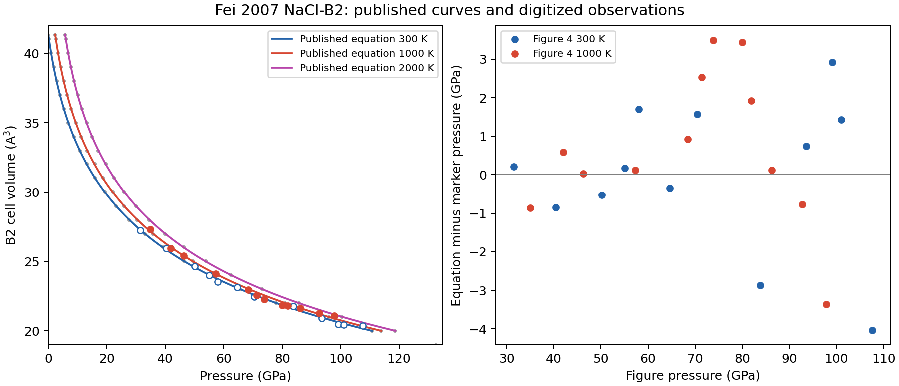

# Fei 2007 NaCl B2 thermal EOS recovery

The published NaCl-B2 Vinet-Mie-Gruneisen-Debye pressure equation is independently
verified. The original PDF yields 12 room-temperature study observations and
12 observations at 1000 K, including both hot markers omitted by the earlier
raster extraction. These are figure-digitized measurements, not the original
unrounded numerical dataset. The cold fit closely recovers the published
coefficients; the available hot-data diagnostic does not reproduce the published
q or its uncertainty. Neither curve agreement nor coefficient proximity establishes
absolute pressure accuracy.

Primary source: Fei et al. (2007), *Toward an internally consistent pressure
scale*, PNAS **104**, 9182-9186,
[DOI 10.1073/pnas.0609013104](https://www.pnas.org/doi/10.1073/pnas.0609013104),
also [archived by PMC](https://pmc.ncbi.nlm.nih.gov/articles/PMC1890468/).
Table 1 and Equations 2-3 are on page 9183; Figures 3-4 and the NaCl discussion
are on page 9184; Methods continues across pages 9185-9186. The inspected local
five-page PDF has SHA256
`19109c9685f6862c733ffc14ada22077d61553152b18dab13eb295e8d1da3306`.

## Source procedure and coefficient choices

The NaCl experiment used Pt powder mixed with iron-free silicate perovskite,
sandwiched between NaCl layers, in a 100 micrometre diameter chamber in a
22 micrometre thick Re gasket. Beveled diamonds had 200 micrometre culets.
Room-temperature diffraction measurements reached 107 GPa and followed
laser annealing near 1600 K. Annealing sharpened diffraction peaks and improved
least-squares cell-parameter fits across reflections.

At 1000 K, the experiment used external resistance heating and collected
diffraction during decompression from 98 to 34 GPa. The heater operated in Ar
with 1% H2; temperatures were measured with a Pt-Pt 10% Rh thermocouple.
Methods gives a 0.3311 angstrom wavelength, a 6 by 7 micrometre beam, a Mar CCD,
FIT2D integration, CeO2 detector calibration, and cell parameters fitted to
observed diffraction peaks. No numerical P/V/T measurement-error columns or
thermocouple-error widths are supplied in the recovered material.

Pt cell parameters determine the study's NaCl pressure targets using the
published Fei (2007) Pt scale. Figure 3's Sata (2002) open diamonds use
Speziale (2001) MgO; Ono (2006) open squares use the paper's Au scale. They
are comparison observations, not the filled study circles identified by the
caption as the cold fit input. Earlier scattered NaCl studies are discussed as
comparisons too. None of those other-paper observations enter this replay.

The paper describes a least-squares cold Vinet fit with V0 fixed, fitting K0 and
K0-prime; its BM3 fit uses the same cold data with different coefficients.
The thermal EOS is fitted to the Mie-Gruneisen relation. Table 1 explicitly
adopts V0, gamma0, and theta0 from Bukowinski and Aidun (1985), leaving q as
the thermal parameter to determine with those adopted values. The source does
not specify an executable optimization recipe, residual direction, data weights,
parameter covariance, or a confidence convention for the printed error widths.
This is a described experimental and fitting sequence with unrecovered details,
not an undescribed procedure.

| Parameter | Published Vinet-MGD value | Treatment |
| --- | --- | --- |
| V0 | 41.35 angstrom^3 | Adopted, fixed |
| K0 | 26.86(2.90) GPa | Cold fit |
| K0-prime | 5.25(26) | Cold fit; error width 0.26 |
| gamma0 | 1.70 | Adopted |
| theta0 | 290 K | Adopted |
| q | 0.5(3) | Thermal fit; error width 0.3 |
| Reference T | 300 K | Debye-energy subtraction |

The separate BM3 values are K0=30.69(2.90) GPa and K0-prime=4.33(26).
They must not be inserted into a Vinet EOS. Printed widths are retained as
published with unknown confidence; they are not measurement weights.

## Equations and normalization

For x=(V/V0)^(1/3), Equation 2 is

```text
P300 = 3*K0*(1-x)/x^2 * exp[1.5*(K0-prime-1)*(1-x)]
gamma(V) = gamma0*(V/V0)^q
theta(V) = theta0*(V/V0)^[-gamma(V)]  (printed convention)
P(V,T) = P300(V) + gamma(V)/Vm * [E(T,theta)-E(300,theta)]
E(T,theta) = 9*n*R*T*(T/theta)^3 * integral_0^(theta/T) z^3/(exp(z)-1) dz
```

The B2 cell is Pm-3m and contains **one NaCl formula unit, two atoms**.
The pressure calculation uses `n=2` and Vm=V*N_A*10^-30 cubic metres per mole
of NaCl formula units. Thermal pressure in pascals is converted to GPa. No
four-formula-unit B1 normalization or four-atom fcc-metal normalization applies.
The same theta at the current volume enters both energies, with exactly 300 K
as the reference. Zero-point energy cancels in this fixed-volume subtraction.

Independent SI quadrature and the legacy executable record agree to
1.14e-13 GPa over five volumes and temperatures 300, 1000, and 2000 K. The new
canonical `nacl_b2_fei_2007` record in `nacl_b2.eosmat` preserves the coefficients,
the explicit printed `variable_exponent` law, and the error widths. It is not
made the default. The 2000 K checks concern calculated extrapolation: the
experimental thermal series reaches 1000 K.

For comparison, integrating gamma=-dln(theta)/dln(V) gives
theta=theta0*exp[-gamma0*((V/V0)^q-1)/q]. The explicitly printed expression
instead implies -dln(theta)/dln(V)=gamma(V)*[1+q*ln(V/V0)]. The pressure record
retains the source expression; this audit does not establish a caloric potential
or thermodynamically consistent caloric derivatives.

## Recovered numerical observations and drawn curves

The vector recovery retains marker centers, path indices, marker bounds,
axis ticks, the PDF hash and source-page coordinates in
[`nacl-b2-fei-2007-source.json`](https://github.com/CPrescher/peritheos/blob/main/peritheos/data/datasets/nacl-b2-fei-2007-source.json).
The optional `--pdf` extraction requires that exact PDF hash before applying its
visually verified path selection.

- [`Figure 3 CSV`](https://github.com/CPrescher/peritheos/blob/main/peritheos/data/datasets/nacl-b2-fei-2007-figure3-digitized.csv):
  12 filled study circles at 300 K, excluding Sata/Ono symbols.
- [`Figure 4 CSV`](https://github.com/CPrescher/peritheos/blob/main/peritheos/data/datasets/nacl-b2-fei-2007-figure4-digitized.csv):
  12 cold and 12 hot study circles. The two touching hot points near 80 and
  82 GPa remain separate original vector objects.

Figure 3 and Figure 4 cold points are duplicate depictions of the same 12
observations. Their digitized coordinates differ by at most 0.056 GPa and
0.011 angstrom^3; they are never pooled as 24 observations. Their endpoints
are slightly beyond the rounded prose pressure limits. Blank experimental
P/V/T-error and Pt-volume fields mean unavailable, not zero. Decimal precision
records graphical coordinates and their conversion; it does not imply original
measurement precision.

Four source curves are retained separately as **calculated output**: Figure 3's
best fit and the three Figure 4 isotherms each have 24 vector vertices. These
vertices never enter any regression. At fixed source volume, the maximum
horizontal differences for the printed law are 0.064 PDF points for Figure 3,
and 0.099, 0.209, and 0.225 points for Figure 4 at 300, 1000, and 2000 K.
The curve stroke widths are respectively 0.365 and 0.357 points. The integrated
law also falls within a stroke width (and gives smaller hot-curve differences).
Thus both are compatible with the drawn curves at that precision; the curves
cannot uniquely select the theta convention.

## Conditional fitting results

[`fei-2007-nacl-b2-reproduction.json`](../data/fei-2007-nacl-b2-reproduction.json)
records each fit, fixed/free choices, residuals, curve checks, and limitations.

| Diagnostic | Result | Residual measure |
| --- | --- | --- |
| 12 Figure 3 cold rows, V0 fixed | K0=26.8891 GPa; K0-prime=5.24691 | Equal-pressure RMSE 1.8730 GPa |
| Duplicate Figure 4 cold depiction | K0=26.8341 GPa; K0-prime=5.25254 | Equal-pressure RMSE 1.8762 GPa |
| 12 hot rows, published cold/gamma/theta fixed | q=0.98122 | Equal-pressure RMSE 1.8736 GPa |
| Cold Figure 3 fit, then hot q fit | q=0.99339 | Equal-pressure RMSE 1.8740 GPa |
| Hot q fit with integrated-law sensitivity | q=0.94610 | Equal-pressure RMSE 1.8737 GPa |
| Hot q fit minimizing exact volume residuals | q=0.85484 | Equal-volume RMSE 0.14642 angstrom^3 |
| Hot fit excluding both touching markers | q=0.67152 | Ten rows; selection sensitivity only |

The primary equal-pressure hot fit has residual-scaled conditional standard
error 0.436 on q. Cold conditional errors are 2.130 GPa on K0 and 0.270 on
K0-prime. These are linearized errors conditional on digitized coordinates,
selection, adopted parameters and pressure calibration. Thermal fits do not
propagate cold-stage uncertainty or Pt covariance. They are not reproductions
of the source's printed error widths or an absolute accuracy estimate.

The published coefficients yield pressure residual RMSEs of 1.8730 GPa for the
Figure 3 cold observations and 2.0008 GPa for all 12 hot observations. The old
ten-point raster diagnostic (`fei-2007-thermal-comparison.json`, NaCl portion)
excluded two real measurements and used different graphical axis coordinates;
it is superseded for NaCl by this vector-based recovery. Its approximately
0.565 q must not be presented as an author-fit reproduction. Even the ten-point
vector fit differs because axis and marker coordinate recovery changed.

As an illustration, common coordinate perturbations of one Figure 4 stroke
width (0.357 points, equivalent to 0.287 GPa and 0.0617 angstrom^3) give q values
from 0.310 to 2.001. This deliberately simple sensitivity is neither an
experimental error model nor a statistical confidence interval. No justified
source-error-weighted fit is possible with the available columns; weights
must not be invented from marker size or curve stroke width.



## Remaining source and integration gaps

The inspected PDF has model Table 1, but no numerical experimental NaCl/Pt
table. The publisher full text likewise supplies the figures and described
procedure. No article-specific numerical supplement was recovered; the generic
publisher “PDF and Supporting Information” control does not prove that one
exists. Direct publisher PDF/supplement requests returned 403, and the queried
PMC/Europe PMC XML services did not supply the article XML. This is an access
and recovery record, not proof that original data or a supplement never existed.

Exact coefficient/uncertainty reproduction still needs original unrounded NaCl
cells and temperatures, paired measured Pt cells, experimental uncertainty
columns, calibration covariance, the authors' residual direction and weights,
and their optimization/covariance details. An inverse Pt EOS calculation from
plotted pressure would merely reconstruct the calibration output and cannot
replace a measured Pt cell. The Pt investigation remains paused and its
published calibrant was not changed.

Reproduction command:

```bash
python -m scripts.reproduce_fei_2007_nacl_b2
```

Optional recovery command:

```bash
python -m scripts.reproduce_fei_2007_nacl_b2 --pdf /path/to/verified/fei2007.pdf
```

Only NaCl-specific files are changed. After the parallel investigations finish,
update shared manifest counts, audit/fit ledgers and generated catalog/docs as
appropriate; those shared integrations are intentionally left for coordinated
follow-up. Ruff, the normative NaCl schema, and all nine focused tests pass;
the tests pass in both the shell's Python 3.13 and repository Python 3.9
environments. Canonical catalog lookup and thermal discovery also pass in the
repository environment. The shell's full-catalog lookup separately encounters
a pre-existing Python/native signature mismatch in the argon Dewaele model;
direct NaCl document loading works there.
