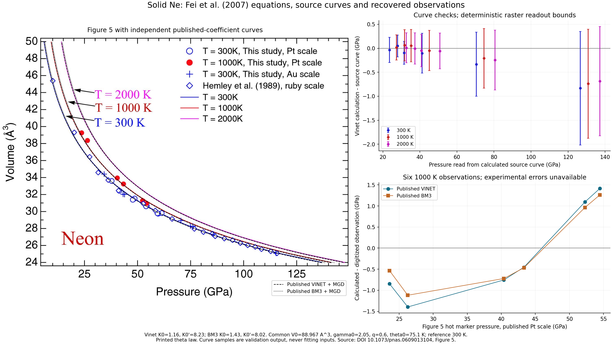

# Fei et al 2007 solid neon thermal EOS reconstruction

**Outcome: Reproduced. Both Ne EOS records reach `parity` under the project's
coefficient-comparison criteria.** The 54-point joint fit recovers K0,
K0-prime and q within their individual published error widths and meets the
ledger's combined-uncertainty and numerical similarity criteria.

Both published cold branches now have executable thermal reconstructions using
Fei's common Table 1 Ne thermal parameters. Independent equations agree with
Peritheos to below 1e-9 GPa. The recovered inputs contain **54 observations**:
35 prior-study table rows and 19 separable markers from Fei Figure 5. Unweighted
cold coefficients and conditional hot q fits agree with the individual printed
error widths, but **exact original-regression recovery and absolute pressure accuracy remain
unestablished**. Paired measured calibrant volumes, complete new-data selection,
weights, covariance, and unrounded author inputs are still missing.

The authority is [Fei et al., PNAS 104, 9182–9186 (2007), DOI
10.1073/pnas.0609013104](https://pmc.ncbi.nlm.nih.gov/articles/PMC1890468/),
Table 1, Eqs. (1)–(3), Ne discussion on p.9185, Figure 5 and Methods.
[Finger et al., Applied Physics Letters 39, 892–894 (1981), DOI
10.1063/1.92597](https://doi.org/10.1063/1.92597) supplies the missing prior
low-pressure series. The [author-institution-hosted publisher
scan](https://hazen.carnegiescience.edu/sites/default/files/061-argon-1981.pdf)
was verified visually on all three pages; its SHA256 is
`a23289268d0a191b894bbeec8920fd4f6ea926847a4a5bc68686aa4a496f8bbb`.
The broken older author-site URL was replaced only for this retrieval.

## Equations and normalization

The source defines total pressure as the chosen 300 K cold equation plus

```
Pth(V,T) = gamma(V) / Vm * [E(T,theta(V)) - E(300 K,theta(V))]
gamma(V) = gamma0 * (V/V0)^q
theta(V) = theta0 * (V/V0)^[-gamma(V)]
E(T,theta) = 9 R T (T/theta)^3 * integral_0^(theta/T) z^3/(exp(z)-1) dz
```

Both energies use the **same volume and Debye temperature**. E is per mole of
Ne atoms; Vm is volume per mole of Ne atoms. The public volume is the
conventional fcc cell containing four atoms, so
`Vm [m3/mol] = Vcell [A3] * NA * 1e-30 / 4`. The corresponding cm3/mol
conversion is 0.150553519 per cell A3. Thus V0=88.967 A3 corresponds to
13.394294924873 cm3/mol. One atom per formula unit means n=1, not four.
There is no additional zero-point-pressure term in this 300 K reference model.

| Parameter | Vinet branch | BM3 branch | Source convention |
|---|---:|---:|---|
| V0, cell A3 | 88.967 | 88.967 | Fixed adopted volume |
| K0, GPa | 1.16(14) | 1.43(14) | Separately fitted cold coefficients |
| K0 prime | 8.23(31) | 8.02(31) | Separately fitted cold coefficients |
| theta0, K | 75.1 | 75.1 | Adopted from Finger Table II |
| gamma0 | 2.05 | 2.05 | Adopted source coefficient |
| q | 0.6(3) | 0.6(3) | One published optimized thermal set |
| Reference temperature, K | 300 | 300 | Eq. (3) subtraction |

Table 1 gives one thermal set alongside both cold equations. Applying that set
to BM3 is an explicit reconstruction; the paper does not supply a separate
BM3 thermal optimization or a distinct BM3 q. The previously imported BM3
V0=4.464^3=88.955449344 A3 was a rounded lattice-derived approximation. It is
corrected to the common source fixed V0=88.967, with the correction recorded.
**Both K0/K0-prime pairs and the Vinet default are preserved.** At 39 A3, the
common thermal increment from 300 to 1000 K is 3.689432554 GPa.

Finger Table II gives an adopted low-temperature V0=13.394 cm3/mol, whose
modern conversion is 88.965041063 A3. This minor rounding difference does not
justify replacing Fei's explicitly printed 88.967. Finger's coefficient 2.05
is called gamma1 in its different law `gamma=1/2+gamma1*V/V0`; Fei explicitly
prints gamma0=2.05 in its own law. The Finger gamma law is not transferred.

The printed variable-exponent theta law differs from the integrated constant-q
relation `theta=theta0*exp[-gamma0*((V/V0)^q-1)/q]`. In particular, the printed
law implies `-d ln(theta)/d ln(V)=gamma(V)*(1+q*ln(V/V0))`, which differs from
gamma(V). Equation agreement here means faithful reconstruction of the printed
pressure prescription; it does not resolve that thermodynamic inconsistency.
Both laws are compared as diagnostics without changing the source record.

The parenthetic errors and unspecified confidence/covariance are retained.
V0, theta0 and gamma0 are source-fixed adopted inputs; q is optimized in the
thermal model. The source reports least-squares room-temperature fitting and
optimized thermal parameters, but does not define the residual objective,
weights, staged versus joint optimization, or uncertainty propagation.

## Recovered observations and calibration pathways

| Contribution | Rows | Temperature | Pressure provenance |
|---|---:|---|---|
| Finger 1981 Table I | 14 | 293 +/- 1 K | Original Piermarini 1975 ruby pressures |
| Hemley 1989 Table I | 21 | 300 K | Printed Mao 1986 ruby pressures, explicitly re-expressed on Dewaele 2004 ruby scale |
| Fei Figure 5 new open circles and crosses | 13 | 300 K | Seven Pt-scale and six Au-scale markers |
| Fei Figure 5 new filled circles | 6 | 1000 K | Published Fei Pt scale |

Finger's raw pressure (kbar), lattice a (A), molar volume (cm3/mol), and every
printed parenthetic uncertainty are preserved in
[`neon-finger-1981-table1.csv`](../../peritheos/data/datasets/neon-finger-1981-table1.csv).
Derived GPa pressures, cell volumes a^3, and first-order cell errors
`3*a^2*sigma_a` occupy separate columns. The printed molar-volume column is
not overwritten; its maximum difference from modern lattice-derived values is
0.001517134 cm3/mol. The table reports crystal/liquid coexistence at
47.5(4) kbar without a volume; it is recorded as metadata and excluded from
P–V fitting. The abstract/narrative instead gives 47.4 +/- 0.5 kbar; that
source discrepancy is preserved. All 14 compression rows span 4.83–14.42 GPa.
Finger identifies its ruby calibration in reference 5 as Piermarini et al.
(1975), DOI 10.1063/1.321957.

Fei explicitly says that **Hemley's** pressures were recalculated to the
Dewaele ruby scale; it does not explicitly specify the same treatment for
Finger. Finger pressures therefore remain on their printed original scale.
Assigning the 293 K Finger rows to Fei's 300 K branch is a diagnostic choice;
an original-temperature sensitivity is reported separately. Numerical
confidence levels for Finger errors are not invented.

The bundled Hemley resource keeps original and recalculated pressure columns.
Independent conversion uses

```
lambda/lambda0 = (1 + 7.665*P_Mao/1904)^(1/7.665)
P_Dewaele = 1904/9.5 * [(lambda/lambda0)^9.5 - 1]
sigma_P_Dewaele = sigma_P_Mao * (lambda/lambda0)^(9.5-7.665)
```

Recomputed pressures agree with the saved recalculated column within
4.93e-10 GPa. This algebraic scale transformation is based on the tabulated
Mao pressures; it does not recover original measured ruby wavelengths or
shared scale uncertainty. W is a pressure-scale consistency comparison in
Fei's discussion, not an additional independent copy of each Hemley point.

The new hot observations are now a bundled numerical resource,
[`neon-fei-2007-figure5-1000k-digitized.csv`](../../peritheos/data/datasets/neon-fei-2007-figure5-1000k-digitized.csv).
It retains the calibrated coordinates, centroids, component sizes and pressure
scale. Empty experimental-error columns mean unavailable errors, not zeros.
The decimal precision records the coordinate conversion reproducibly; it does
not imply that the measurement or graph supports that precision. A common
three-pixel coordinate displacement is used only as a deterministic readout
sensitivity. Axis calibration errors are correlated across all six points.

| Pt-scale pressure from marker, GPa | Ne cell volume from marker, A3 |
|---:|---:|
| 23.5832 | 39.26576 |
| 26.2654 | 38.35568 |
| 40.3745 | 33.95051 |
| 43.3217 | 33.25205 |
| 52.2904 | 31.37129 |
| 54.4717 | 30.99033 |

Figure 5 and Methods identify published Pt/Au calibration pathways. The
paired measured Pt/Au lattice constants or volumes for these new Ne points
are absent from the accessible article. Inverting the published Pt/Au scale
at a plotted pressure would produce a synthetic volume; such an inversion
is not an independently recovered measurement. The Pt scale is retained as
published, with no Pt investigation, recalibration or refit.

The accessible full PMC article contains no numerical table of these new
Ne observations or supplemental-data links. The publisher supplement endpoint
returned HTTP 403 and Europe PMC fulltext XML returned HTTP 500; neither
establishes that a supplement is absent. Scoped DOI searches for archived data,
including Zenodo and figshare, did not recover the new or paired observations.
These access/search outcomes are recorded in
[`neon-fei-2007-source.json`](../../peritheos/data/datasets/neon-fei-2007-source.json).
Source rights are retained: Peritheos transcription/conversion/metadata can
carry contributor licensing without claiming rights to the third-party source.

[Dewaele et al. (2008), DOI 10.1103/PhysRevB.77.094106](https://harvest.aps.org/v2/journals/articles/10.1103/PhysRevB.77.094106/fulltext),
pp.094106-2 and -5, independently replots the six Fei hot points; its own
Table I contains separate measurements and is not additional Fei fitting
input. Note 29 on p.094106-9 describes a 0 K reinterpretation, but contains a
self-referential citation number. The surrounding discussion suggests a
reference to Fei; it is not a recovered Fei erratum. Fei's Eq. (3) and
Figure 5 support retaining the 300 K subtraction. Later observations or
comparisons do not establish the absolute accuracy of Fei's scale.

## Numerical fit reconstruction

The Ne-only audit uses pressure residuals and preserves all source coefficients
in the records. Curve samples are excluded from every fit. Unweighted cold
fits use the 48 recovered room-temperature points with fixed V0; conditional
hot fits free q only, keeping the published cold coefficients, gamma0 and
theta0 fixed. The staged fit uses the recovered cold diagnostic first. The
54-point joint diagnostic frees K0, K0-prime and q together. These are explicit
reconstruction choices, not recovered author instructions.

The joint fit gives the following comparison. Our errors are conditional,
residual-scaled standard errors; the source does not specify the confidence
level of its printed errors.

| Branch | Parameter | Published | Joint 54-point fit |
|---|---|---:|---:|
| Vinet | K0, GPa | 1.16 +/- 0.14 | 1.1904 +/- 0.0448 |
| Vinet | K0 prime | 8.23 +/- 0.31 | 8.1765 +/- 0.0771 |
| Vinet | q | 0.6 +/- 0.3 | 0.6223 +/- 0.1334 |
| BM3 | K0, GPa | 1.43 +/- 0.14 | 1.5182 +/- 0.1195 |
| BM3 | K0 prime | 8.02 +/- 0.31 | 7.7138 +/- 0.3806 |
| BM3 | q | 0.6 +/- 0.3 | 0.6182 +/- 0.1288 |

All six coefficients meet the project's `parity` criteria. The q comparison
uses Fei's one common thermal parameter set for both cold branches.

| Diagnostic | Vinet K0, GPa | Vinet K0 prime | BM3 K0, GPa | BM3 K0 prime |
|---|---:|---:|---:|---:|
| All 48 cold points, unweighted | 1.182686 | 8.190358 | 1.496258 | 7.785701 |
| Prior 35 table rows, unweighted | 1.200440 | 8.160190 | 1.478130 | 7.842861 |
| Prior 35 rows, pressure-error weighted | 1.382553 | 7.858856 | 1.625959 | 7.369087 |
| Prior 35 rows, effective pressure/volume-error weighted | 1.568404 | 7.464402 | 1.923400 | 6.487313 |

The all-cold Vinet differences are 0.162 and 0.128 of the quoted K0 and
K0-prime error widths; BM3 differences are 0.473 and 0.756. Thus both cold
pairs agree within **individual source error widths**. This does not establish
joint uncertainty agreement: diagnostic cold parameters are strongly
anticorrelated, about -0.998 (Vinet) and -0.9996 (BM3), and source covariance
is unavailable. The complete author's new-data selection is also unverified.

Weighted fits use only the 35 original table rows with reported errors.
The 19 new-marker readout bounds are not substituted for source measurement
errors. Effective-error weighting uses
`sigma_eff = hypot(sigma_P, (dP/dV)*sigma_V)` with slopes frozen at the
published model. It omits common calibration correlations and temperature
uncertainty. These weighted fits substantially shift the coefficients and can
increase unweighted pressure RMS, because precise low-pressure rows receive
much more influence. They are sensitivity results, not improved original-fit
parity. Reusing Finger's original 293 K temperature in the effective-error
fit gives Vinet (1.587818, 7.435869) and BM3 (1.956475, 6.422630).

| Hot diagnostic | Vinet q | BM3 q | Qualification |
|---|---:|---:|---|
| Six markers, published cold coefficients | 0.588856 | 0.597153 | Equal pressure weights |
| Six markers, recovered 48-point cold fit | 0.615554 | 0.611107 | Staged sensitivity |
| Joint 54-point pressure fit | 0.622296 | 0.618175 | K0/K0-prime/q free together |
| Integrated theta law with published cold coefficients | 0.576071 | 0.584732 | Equation sensitivity only |

For the published-cold q fits, conditional residual-scaled errors are
0.1273 (Vinet) and 0.1090 (BM3), distinct from the published 0.3. These
conditional errors omit source calibration/temperature uncertainty and
correlations. Published hot-marker RMS is 1.0528 GPa (Vinet) and 0.8944 GPa
(BM3); freeing q barely reduces it to 1.0520 and 0.8943 GPa. The residuals
change sign across the pressure range. Agreement in q therefore does not
mean the six individual measurements are reproduced exactly.

The illustrative common three-pixel readout shifts give q ranges
0.4312–0.7704 (Vinet) and 0.4390–0.7797 (BM3). They are neither statistical
confidence intervals nor experimental uncertainties. No source-error-weighted
hot fit is possible with the current inputs; original temperature errors,
paired calibrant errors and cross-point correlations remain unrecovered.

## Independent checks against calculated curves

Six clean raster scanlines provide 18 **calculated curve samples**, separate
from the 54 observed inputs. Stroke selection uses color and visually checked
clean locations, never closeness to a model prediction. Original coordinates,
stroke spans, calibrated values, and both theta-law predictions are saved.

| Cold equation with printed theta law | 300 K curve RMS, GPa | 1000 K curve RMS, GPa | 2000 K curve RMS, GPa |
|---|---:|---:|---:|
| Vinet | 0.3719 | 0.3160 | 0.2988 |
| BM3 | 0.2587 | 0.2471 | 0.2505 |

The Figure 5 caption does not name the cold branch. Both calculations are
close to the raster strokes at the available resolution; this is not proof
of exact curve parity or evidence that BM3's thermal parameters were separately
optimized. The largest Vinet offset is 0.8339 GPa near 126.6 GPa on the cold
curve. Stroke half-width plus an illustrative one pixel per calibrated
coordinate bounds every sampled Vinet offset. Those bounds are deterministic
readout sensitivities, not fitted source error bars.

Subtracting the 300 K curve at the same volume removes the cold equation.
The 1000 K thermal increment has RMS difference 0.0945 GPa and maximum
0.1522 GPa; the 2000 K increment has RMS 0.0806 GPa and maximum 0.1488 GPa.
The raster cannot securely discriminate printed from integrated theta(V).
Source equation typography remains the basis for the implemented law.
The 2000 K isotherm is calculated extrapolation; measurements support the
thermal fit only through 1000 K. Figure 5 high-pressure curve samples also
extend beyond the measured new hot-marker pressure range.



## Reproduction and integration

Run `.venv/bin/python -m scripts.reproduce_fei_2007_neon` to regenerate
[`fei-2007-neon-reproduction.json`](../data/fei-2007-neon-reproduction.json)
and the validation PNG. The script constructs only the Ne material, avoiding
unrelated catalog-model imports. Both branches match independent Debye
quadrature to below 1e-9 GPa and pass pressure-volume inversion checks.
Tests verify normalization, source hashes, original versus recalculated
pressures, uncertainty types, input counts, fitted diagnostics and exclusion
of calculated curve samples from fitting.

The changes are confined to Ne data/records, this audit/report, and the
Ne assertion block in `test_materials.py`. No default is switched; no
platinum, shared material constructors, manifest or global ledger is edited.
The shared primary-refit ledger still describes its earlier 34-point Ne
partial diagnostic. This standalone 54-point audit is the current detailed
Ne evidence; reconciling that shared ledger belongs to a later coordinated
integration and must not be mistaken for completed global regeneration.
