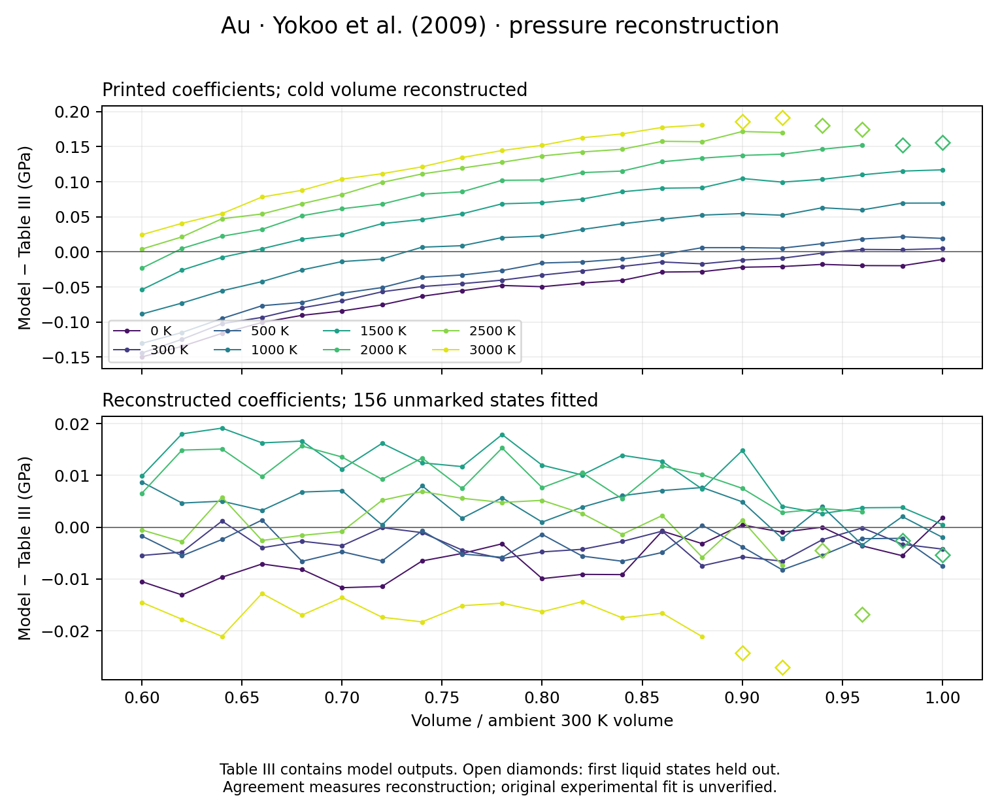

# Yokoo et al. (2009): Au reference isotherms and thermal-source audit

The supplied [Yokoo et al., Physical Review B 80,
104114](https://doi.org/10.1103/PhysRevB.80.104114) primary PDF was inspected
on 2026-10-09. Au Tables I-III, their footnotes, Equations (1)-(18), and
Sections II-III were checked against the rendered pages. The source checksum,
Table II coefficients, equations, and outstanding dependencies are preserved
in `peritheos/data/datasets/gold-yokoo-2009-source.json`.

## Accepted 300 K branches

Two records preserve the published fits to the full model's 300 K isotherm:

| Record | Equation | V0 (ų/four-atom fcc cell) | K0 (GPa) | K0' |
|---|---|---:|---:|---:|
| `gold_yokoo_2009_bm3_300k` | BM3 | 67.72 | 167.5 | 5.79 |
| `gold_yokoo_2009_vinet_300k` | Vinet | 67.72 | 167.5 | 5.94 |

Table II footnote a identifies the unparenthesized pressure derivative as
the BM3 fit and the parenthesized value as the Vinet fit. The table's
**0 K** values, K0=180 GPa and K0'=5.61±0.10, belong to a different cold
branch with a different reference volume. They must not be mixed with the
300 K parameters, and their error width must not migrate to either 300 K fit.
No parameter errors, confidence convention, or covariance are supplied for
the fitted 300 K branches.

The source gives ambient density **19.32 Mg/m³**, rather than a cell volume.
Using four Au atoms, molar mass 196.96657 g/mol, and exact N_A gives
V0=67.7164978079 ų/cell, rounded to **67.72 ų/cell** at the density's
four-significant-figure precision. The molar mass and rounding are explicit
conversion conventions; no exact unrounded author volume or density
uncertainty is recovered. V/V0 is always normalized to this ambient 300 K
volume, not the unreported cold volume Vc.

With `r=V/V0`, the independent equations used for verification are

`P_BM3 = 1.5 K0 (r^(-7/3)-r^(-5/3)) [1+0.75(K0'-4)(r^(-2/3)-1)]`,

`P_Vinet = 3 K0 (1-x) x^-2 exp[1.5(K0'-1)(1-x)]`, `x=r^(1/3)`.

The modeled compression range r=0.6-1 gives 0-368.910 GPa for BM3 and
0-352.849 GPa for Vinet at 300 K. These ranges describe the represented
equations, not measured static coverage or a new phase-stability guarantee.
Existing Au records and the default scale are preserved.

## Full-model output and phase annotations

All **162 populated Table III states** are transcribed in
`gold-yokoo-2009-table3-isochores.csv`, covering 21 volume ratios and eight
temperature columns between 0 and 3000 K. These are **derived full-model
EOS outputs**, not observations and not evaluations of the separate fitted
BM3 or Vinet branches. Table III explicitly marks parentheses as the first
liquid state at each ratio:

| V/V0 | First liquid entry (K) | Source pressure (GPa) | Subsequent blank temperatures (K) |
|---:|---:|---:|---|
| 1.00 | 2000 | 12.18 | 2500, 3000 |
| 0.98 | 2000 | 15.56 | 2500, 3000 |
| 0.96 | 2500 | 22.99 | 3000 |
| 0.94 | 2500 | 27.47 | 3000 |
| 0.92 | 3000 | 36.10 | none |
| 0.90 | 3000 | 42.06 | none |

The six blank cells remain absent from the CSV and are enumerated in the
source manifest. No values are extrapolated beyond these markers. The
markers retain the source's convention; they do not establish an independently
verified melting boundary or validate a solid-state model in the liquid.

On the 21-state 300 K grid, the published BM3 and Vinet fits differ from
Table III by as much as **2.959874 GPa** and **13.100755 GPa**, respectively.
At r=0.6, Table III gives 365.95 GPa, versus 368.909874 GPa (BM3) and
352.849245 GPa (Vinet). Equation verification therefore must use each
published branch's own formula, rather than demand exact agreement with
the full-model table or silently refit its coefficients.

## Thermal equations and outstanding inputs

Equation (1) is the absolute decomposition

`P(V,T)=Pc(V,0)+Pph(V,T)+Pel(V,T)`.

The cold BM3 uses K0=180 GPa, K0'=5.61 and an unreported **0 K Vc**.
Fitting only Vc/V0 to the 21 derived 0 K Table III checkpoints, while fixing
those printed coefficients, gives **0.9901904131**, with maximum pressure
residual **0.004452 GPa**. This is a circular checkpoint reconstruction,
not an independently recovered author reference volume or original fit.
It is not inserted into either accepted record.

The phonon equations are available:

`gamma(V)=2.96 [1+0.45((V/V0)^4.2-1)]`,

`theta(V)=170 (V/V0)^[-(1-0.45)2.96] exp[-(gamma(V)-2.96)/4.2] K`,

`Eph=3 n kB T D3(theta/T)`, `Pph=gamma Eph/V`.

For molar energies, use R per mole of Au atoms and
`Vm=Vcell N_A/4`. The printed energy has no explicit zero-point term, and
the phonon pressure is absolute. A 300 K-subtracted phonon correction
added to the 0 K cold curve would change the source equation. The printed
a=0.45±0.09 and b=4.2±0.6 errors have no stated confidence convention or
covariance. The explicit 2σ statement concerns the **shock velocity
regression** coefficients S and Q, rather than all EOS parameters.

The Au electronic contribution is imported from
[Tsuchiya and Kawamura (2002)](https://doi.org/10.1103/PhysRevB.66.094115).
The upstream paper and its
[2003 erratum](https://doi.org/10.1103/PhysRevB.67.019902) became available
during this extraction and were inspected visually. All **51 electronic
pressure nodes** at 100 K intervals from 0 to 5000 K are now bundled in
`tsuchiya-kawamura-2002-table1-electronic-pressure.csv`. This theoretical
table retains both original and corrected Au values. The erratum changes
nine Au entries at 3100-3900 K, above Yokoo Table III's temperature range;
Au pressures at 0, 300, 1000, 2000 and 3000 K remain 0.00, 0.00, 0.01,
0.05 and 0.12 GPa. The reference is the electronic free-energy increment
relative to 0 K.

The upstream free-energy volume fits indicate near volume independence within
their calculated range. They do not provide a complete numerical Eel(V,T)
or DOS grid, an author-specified interpolation rule, or Yokoo's adopted
high-compression/high-temperature implementation. The latter matters for
replaying the shock reduction, which reaches much higher temperatures than
the tabulated electronic pressures. The Au audit uses exact printed nodes
only, without interpolating or extrapolating this table.

A source-exact continuous Yokoo thermal catalog record remains unresolved
because its cold Vc and unrounded phonon normalization are unavailable and
the printed coefficients leave the pressure mismatch quantified below.
The recovered electronic pressure nodes suffice for a bounded PVT
reconstruction with an explicitly chosen interpolation rule; missing Eel
is not a PVT blocker. A separate executable **table-output pressure reconstruction** is now
available below, using the recovered inputs without awaiting author replies.
Eel and its temperature derivative are additionally necessary for original
shock-temperature and caloric calculations; a pressure table alone does not
determine them.

The difference `P_table-P_table_0K-Pph` is retained only as a diagnostic.
At r=0.6 and T=3000 K it is -0.05419 GPa; rounded coefficients, volume
normalization and table rounding prevent interpreting that subtraction as
an exact electronic-pressure observation. Adding the actual upstream
electronic nodes to the printed phonon calculation and Table III cold
checkpoints leaves a maximum discrepancy of **0.212465 GPa** over the
populated grid. This is a diagnostic using derived cold outputs, rather than
an independent full-model reproduction or a determination of the discrepancy's
cause. No quadratic electronic law, interpolated total-pressure surface or
phonon-only approximation replaces the source.

## Thermal reconstruction from available model outputs

**Scientific validation: `not_reproduced`.** The altered coefficients
reconstruct Table III closely, but the published analytical PVT remains
unreproduced. The [pressure-convention audit](yokoo-2009-pressure-conventions.md)
tests this distinction without empirical corrections. Caloric properties
and the original optimization are not prerequisites for PVT evaluation.
The reconstructed values remain explicitly accepted, nondefault diagnostics.

The recovered information is sufficient to reconstruct a continuous **pressure**
model close to Table III. Run:

```bash
python -m scripts.fit_yokoo_2009_gold_thermal --check
python -m scripts.fit_yokoo_2009_gold_thermal --pressure 0.8 1500
```

This reconstruction is now registered as the nondefault **derived** record
`gold_yokoo_2009_pvt_reconstruction`. The normal catalog supports pressure,
volume and temperature inversions and lossless interchange. See the
[Au/Pt PVT library audit](yokoo-2009-pvt-library.md) for usage and limits.

The model adds absolute BM3 cold pressure, the integrated asymptotic Debye
phonon pressure, and the corrected upstream electronic-pressure table. It
keeps **Vc** for the cold reference separate from ambient **V0** for gamma,
theta and molar-volume conversion. The electronic pressure is assumed volume
independent and interpolated linearly between nodes. This interpolation is
an explicit reconstruction choice; every fitted temperature coincides with
a printed electronic node, so interpolation does not affect fitted parameters.
Pressure evaluation is bounded to V/V0=0.6-1 and T=0-3000 K. These bounds do
not certify phase stability or justify filling the source's missing liquid
cells. Electronic energies and caloric properties are not reconstructed.

The primary fit uses equal pressure weights for **156 unmarked Table III
states**, holding out all six first-liquid markers. K0=180 GPa and theta0=170 K
are fixed at the printed values; Vc/V0, K0', gamma0, a and b are refined.
The inferred Vc/V0 is **0.990178120**, or **67.054862 ų/four-atom cell**
with the documented V0=67.72 ų conversion.

| Parameter | Published | Reconstructed | Relative change |
|---|---:|---:|---:|
| Cold K0' | 5.61 | 5.610131 | +0.0023% |
| gamma0 | 2.96 | 2.923265 | -1.2411% |
| a | 0.45 | 0.447533 | -0.5483% |
| b | 4.2 | 4.215496 | +0.3689% |

The fitted pressure RMS difference is **0.008923 GPa**, and the maximum
absolute difference is **0.021133 GPa**. The six marked liquid states,
evaluated separately, have RMS **0.016643 GPa** and maximum **0.027082 GPa**.
The printed coefficients with only Vc reconstructed have RMS **0.083390 GPa**
on the same 156-state selection. Reconstruction therefore substantially
improves agreement, with modest changes to the published coefficients.
The largest coefficient change is gamma0; this exceeds its printed decimal
rounding and its cause is not established. Pressure discrepancies exceed
the table's 0.005 GPa half-step, so this is close agreement rather than an
exact reproduction explainable entirely by rounding.



The archived sensitivity checks give:

- Three distinct starting guesses converge to the same primary solution.
- Fitting 82 states on alternate complete isochores and holding out 74
  unmarked states gives withheld RMS **0.009076 GPa**, maximum **0.018672 GPa**.
  This checks interpolation of derived output, not independent experiments.
- Including all 162 populated states gives gamma0=2.924605, a=0.447773,
  b=4.218408 and K0'=5.610192, close to the primary fit.
- Refining K0 additionally gives **179.974964 GPa** and RMS **0.008893 GPa**.
- Refining both K0 and theta0 gives **179.958098 GPa**, **173.378041 K**
  and RMS **0.007986 GPa**. This small residual improvement does not establish
  a better physical estimate of theta0.
- Using the unrounded density-to-volume conversion gives gamma0=2.923114
  and RMS **0.008926 GPa**. That convention has little effect on the result.
- Fixed quadrature and an independent adaptive SI calculation agree to
  **6e-14 GPa** on every source state.

The [machine-readable reconstruction](../data/yokoo-2009-gold-thermal-reconstruction.json)
archives coefficients, input hashes, objective, bounds, selections, holdouts,
and all residuals. The [residual CSV](../data/yokoo-2009-gold-thermal-residuals.csv)
retains source phase annotations and identifies each state's fitting role.
Regenerate the figure and outputs with `--plot`; `--check` verifies the JSON
and CSV against a fresh calculation.

These coefficients are explicitly **derived from published model outputs**.
No experimental observations, parameter uncertainties or covariance are
inferred from their residuals. Published catalog coefficients and their
author-fit ledger statuses remain unchanged. This reconstructs the pressure
surface under stated assumptions; it does not reproduce the authors' joint
shock/ambient optimization or supply missing electronic caloric information.

## Original fitting and comparison evidence

Section II.B publishes the fitted shock relation

`Us=2.995+1.653 up-0.013 up²`, for `up<=3.5 km/s`,

with S error 0.056 and Q error 0.019 (km/s)^-1 at **2σ**. Equations (14)-(15)
give `Vh/V0=1-up/Us` and `Ph-P0=rho0 Us up`. These are preserved as
published equations with derived numerical checkpoints, never manufactured
experimental shots. The 2009 paper does not tabulate the complete shock
observations from its reference 8 and shock compilations.

Table I supplies ambient-property ranges and approximate errors; the
numerical selection used in the joint fit is not supplied. Section II.C
uses thermodynamic inputs up to 1000 K. The prose reverses the author names
attached to references 21 and 22 relative to the bibliography, so the audit
retains reference numbers and does not silently choose a data source.
Section II.D specifies simultaneous steepest-descent least squares with
respect to total pressures and adjustable cold K0', a and b, with gamma0
obtained secondarily. Complete input rows, exact weights, source selections,
unrounded values, numerical electronic energy/DOS and covariance remain
unavailable. Both accepted 300 K
records are consequently **not_refittable** in the author-fit ledger,
despite successful deterministic equation reproduction.

The existing Dewaele (2004) data provide 37 Au rows, of which 36 have
simultaneous Pt volumes. The audit retains those pairs, source row indices,
volume errors, and both original ruby-pressure columns. Derived Au BM3 and
Vinet pressures are added as comparison calculations alongside the already
audited Pt Vinet pressure. This compares fitted isotherms; it does not replay
Figure 6 exactly, which uses the full models. Ruby pressures are not replaced,
and comparison data are not promoted to primary fit observations.

## Reproduction and verification

`scripts/reproduce_yokoo_2009_gold.py` produces
`docs/data/yokoo-2009-gold-reproduction.json`; `--check` verifies every saved
result with floating-point tolerances and input hashes. Independent formula
agreement is better than 4e-13 GPa on six compression states for both
branches; pressure-volume inversion error is below 4e-13 ų. Tests also
verify interchange, integrated Debye/gamma consistency, error conventions,
source-table omissions, phase markers and the distinction between model
outputs and measured inputs.

The companion [Pt audit](yokoo-2009-platinum.md) documents the same paper's
platinum branch and electronic-source dependency.

The [Au PVT validation](gold-pvt-validation.md) independently checks the
published Fei Au scale and records this reconstruction's qualified numerical
validation separately from recovery of the full published Yokoo equation.
