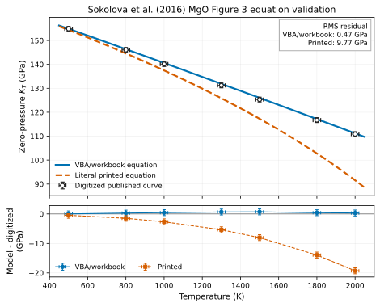

# Sokolova–Dorogokupets equation and table audit

This audit checks every Dorogokupets/Sokolova source that directly underlies a
thermal equation or parameter set in Peritheos. It separates three questions:

1. Does the implementation evaluate the equation printed in the paper?
2. Does it reproduce the paper's numerical pressure tables?
3. Does it reproduce the later Excel calculator?

Those questions are not equivalent for the intrinsic-anharmonic MgO term.

## Executive result

| Source | Equation represented in Peritheos | Numerical check | Verdict |
|---|---|---|---|
| [Dorogokupets & Oganov (2007)](https://doi.org/10.1103/PhysRevB.75.024115) | Literal four-oscillator equations (7–14) in `DorogokupetsOganov2007` | All 304 pressure cells in Tables II–X checked; maximum absolute deviation 0.226 GPa | Reproduced within the precision of the rounded Table I parameters |
| [Dorogokupets (2010)](https://doi.org/10.1007/s00269-010-0367-2) | Equations (1–2), Fit #1, in `MieGruneisenEinstein` | Three explicit pressures reproduced within 0.004 GPa | Exact for Fit #1; the class does not represent Fits #2–#6 or their optional anharmonic term |
| [Dorogokupets et al. (2012)](https://doi.org/10.5800/GT-2012-3-2-0067) | Printed equations and Table 4 parameters for diamond and nine metals | All 1,684 positive-temperature cells in Tables 1B–10B checked | Nine materials agree within 0.008 GPa; Mo has a small systematic maximum deviation of 0.155 GPa |
| [Sokolova et al. (2013)](https://doi.org/10.1016/j.rgg.2013.01.005) | Printed equations when `a0 = 0`; later workbook calculation path when `a0 != 0` | Corrected Mo Table 8: max 0.00054 GPa. Corrected Au Table 10: max 0.0033 GPa. MgO Table 6 is internally inconsistent | Mo and Au reproduce. MgO cannot be reproduced from the parameters stated in the same paper |
| [Sokolova et al. (2016)](https://doi.org/10.1016/j.cageo.2016.06.002) | The distributed Excel/VBA calculation path | Existing Figure 2 workbook regression reproduces all eight MgO values | Correct for the workbook, but not algebraically identical to the printed intrinsic-anharmonic equation |

## Equation comparison

### Dorogokupets & Oganov (2007)

`DorogokupetsOganov2007` follows the paper directly:

- the volume law for the Grüneisen parameter,
  `gamma_inf + (gamma0 - gamma_inf) x^beta`;
- the corresponding integrated characteristic temperatures;
- two generalized Bose–Einstein and two Einstein oscillator terms;
- intrinsic anharmonic, electronic, and defect terms; and
- subtraction of the thermal pressure at 298.15 K.

The largest table deviations occur for Cu (0.226 GPa), Al (0.162 GPa), Ta
(0.156 GPa), MgO (0.144 GPa), and W (0.060 GPa). The remaining four materials
are within 0.018 GPa. The smooth, small residuals are consistent with using the
rounded parameters printed in Table I rather than hidden fit precision.

### Dorogokupets (2010)

`MieGruneisenEinstein` is a faithful implementation of the paper's Fit #1:

```text
gamma(x) = gamma0 x^q
theta(x) = theta0 exp[gamma0 (1 - x^q) / q]
P(V,T) = P_300(V) + gamma(V)/V [E(V,T) - E(V,Tr)]
```

The published checks are:

| x | T (K) | Paper (GPa) | Peritheos (GPa) | Difference (GPa) |
|---:|---:|---:|---:|---:|
| 1.00 | 3000 | 17.69 | 17.69343 | +0.00343 |
| 0.85 | 3000 | 51.69 | 51.69056 | +0.00056 |
| 0.64 | 3663 | 190.72 | 190.72201 | +0.00201 |

Fit #2 uses an asymptotic Grüneisen law instead. Fits #3–#6 introduce further
parameterizations, including the optional `a0` contribution in Fit #5. Those
are alternatives discussed by the paper, not configurations of the current
generic class.

### Dorogokupets et al. (2012)

For diamond, Al, Cu, Nb, Ag, Ta, W, Pt, and Au, recalculation of every appendix
pressure at `T > 0` gives a maximum absolute deviation between 0.0022 and
0.0078 GPa. Diamond and all nine metals have no active intrinsic-anharmonic
term, so the paper equation and the later workbook equation collapse to the
same pressure expression.

Mo is the only reproducibility exception: its 168 checked cells have a maximum
absolute deviation of 0.155 GPa and RMS deviation of 0.077 GPa. The discrepancy
is systematic at high temperature and cannot be removed by substituting the
nearby `e0 = 143.1` value from Table 2 for `e0 = 143.2` in Table 4. It is small
relative to the 396 GPa endpoint (0.04%), but it indicates rounded or unstated
calculation parameters.

### Sokolova et al. (2013) and the 2016 workbook

The printed paper makes intrinsic anharmonicity temperature-dependent through
equation (6):

```text
theta(V,T) = theta(V) exp[a0 x^m T / 2]
```

Its equation (9) therefore changes both the oscillator occupation and the
pressure multiplier:

```text
Pth proportional to theta(V,T) / (exp(theta(V,T)/T) - 1)
                 * [gamma(V) - m a0 x^m T / 2]
```

The Excel/VBA calculation instead keeps `theta` dependent on volume only and
adds a separate quadratic pressure term proportional to
`a0 m x^m (T^2 - Tr^2)`. Peritheos intentionally implements that workbook path
because the 2016 spreadsheet is the distributed calculator and the existing
regression target.

This distinction is inactive for diamond and the nine metals (`a0 = 0`). On a
grid of `x = 1.0, 0.8, 0.6` at 3000 K, the literal printed expression and the
workbook agree for all ten to below `5e-9` GPa. MgO is the sole affected
material.

For the current 2016 MgO parameters (`a0 = -17.4`, `m = 4.95`), at `x = 1` and
3000 K:

| Calculation path | Pressure (GPa) |
|---|---:|
| Printed intrinsic-anharmonic equation | 19.58435 |
| Excel/VBA and current Peritheos implementation | 16.27890 |
| Difference | 3.30545 |

At 3500 K the difference grows to 4.52935 GPa, although 3500 K lies beyond the
2016 calculator's stated 3000 K range.

## Plot digitization

Plots were digitized only where the competing equations produce visibly
different curves. Numerical tables remain the more accurate validation source
for the 2007, 2012, and 2013 papers. The digitized coordinates, model values,
and estimated reading uncertainty are committed as reusable CSV files.

### Dorogokupets (2010), Figure 1

Figure 1 contains three calculated curves and no experimental data. The dashed
curve was graphically transcribed from Figure 6 of Speziale et al. (2001); the
two solid curves are Dorogokupets' Fits #1 and #2. The dashed curve was sampled
at 11 points between 151 and 185 GPa. The estimated digitization uncertainty is
+/-0.3 GPa in pressure and +/-0.0005 in `V/V0`.

| Candidate | RMS residual in `V/V0` | Maximum absolute residual |
|---|---:|---:|
| Fit #1 (current `MieGruneisenEinstein`) | 0.01494 | 0.01515 |
| Fit #2 (asymptotic Gruneisen law) | 0.00364 | 0.00394 |

The restricted digitized segment gives a smaller residual for Fit #2, but this
relative result must not be described as agreement with data. At `x = 0.64`
and 3663 K, the paper explicitly gives 190.72 GPa for Fit #1, 203.34 GPa for
Fit #2, and approximately 209 GPa for the graphically transcribed Speziale
curve. Fit #2 is therefore still about 5.7 GPa low; Fit #1 is about 18.3 GPa
low. Neither reproduces the dashed source curve, and Figure 1 does not validate
either fit experimentally. The current class intentionally represents Fit #1
and reproduces its printed pressure checks.

Data: [`dorogokupets-2010-figure1-digitized.csv`](data/dorogokupets-2010-figure1-digitized.csv)

### Sokolova et al. (2016), Figure 3

Seven points were digitized from the smooth zero-pressure `K_T(T)` curve for
MgO between 500 and 2000 K. The estimated uncertainty is +/-20 K and +/-1.0
GPa. Each equation was evaluated on its own zero-pressure volume branch.



The upper panel overlays the digitized published curve with dense predictions
from the two equation forms. The lower panel shows model-minus-digitized
residuals; its error bars are the estimated graphical reading uncertainty, not
experimental uncertainty. The figure can be regenerated from the committed CSV
with `python -m scripts.generate_sokolova_figure3_validation` from the project
root.

| Candidate | RMS residual (GPa) | Maximum absolute residual (GPa) |
|---|---:|---:|
| Excel/VBA and current Peritheos path | 0.47 | 0.71 |
| Literal printed intrinsic-anharmonic equation | 9.77 | 19.28 |

The workbook path is about 21 times closer and every sampled point lies within
the estimated reading uncertainty. The literal printed form diverges rapidly
above 1000 K. Therefore the published 2016 thermodynamic curve was generated
with the Excel/workbook form, not with the intrinsic-anharmonic equation as
printed in the article.

This comparison identifies the calculation lineage of the plotted curve; it
does not independently establish which extrapolation is physically correct.
The high-temperature part of the smooth line is itself a model output, and the
experimental points in the figure do not constrain the large separation above
about 1500 K. An independent high-temperature MgO dataset would be needed for
that physical test.

Data: [`sokolova-2016-figure3-kt-digitized.csv`](data/sokolova-2016-figure3-kt-digitized.csv)

The 2016 Au and W plots cannot distinguish the two expressions because their
intrinsic-anharmonic coefficient is zero. Likewise, a 300 K compression curve
cannot discriminate the thermal formulations. For the 2013 MgO case, the
printed pressure table provides a stronger and more precise contradiction than
digitizing a plot.

## The separate 2013 MgO table inconsistency

The 2013 paper's correction paragraph states `a0 = +17.4` and `m = 5.5` for
MgO. Using those parameters with the paper's own equations gives 18.49983 GPa
at `x = 1`, 3500 K, whereas Table 6 prints 19.100 GPa: a 0.60017 GPa error.

Table 6 is much closer to the undocumented combination `a0 = 14.6`, `m = 4.95`
(maximum error 0.090 GPa over its 88 positive-temperature cells). The two
numbers come from different published parameter sets: `a0 = 14.6` is the older
Table 2 value, while `m = 4.95` is in Table 4. Consequently, Table 6 must not be
used as proof that either the stated corrected equation or the 2016 workbook
has been reproduced.

By contrast, the corrected Mo and Au tables are self-consistent when their
correction-paragraph parameters are used:

- Mo Table 8: 72 cells, maximum 0.00054 GPa, RMS 0.00030 GPa.
- Au Table 10: 77 cells, maximum 0.00329 GPa, RMS 0.00150 GPa.

## Regression coverage

`tests/test_sokolova_dorogokupets_literature.py` locks representative rows for
all materials and papers, the 2010 explicit values, the corrected 2013 Mo/Au
tables, the 2013 MgO inconsistency, and the 2016 MgO paper/workbook divergence.
The exhaustive cell-by-cell audit used the numerical appendices extracted from
the source PDFs; the committed tests use representative cells so they do not
depend on local PDF extraction.

The scientific interpretation should remain explicit in user-facing results:

- call the current MgO model **Sokolova 2016 workbook-compatible**;
- do not call it a literal implementation of the printed intrinsic-anharmonic
  equation; and
- do not use the 2013 MgO Table 6 as an independent validation target without
  noting its internal parameter inconsistency.
